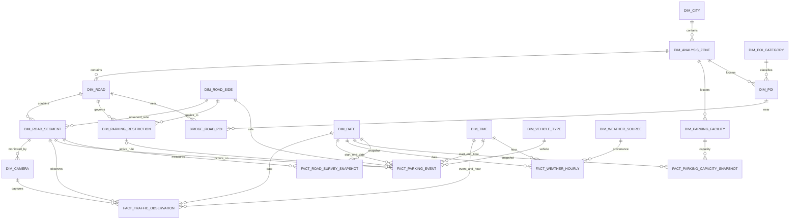
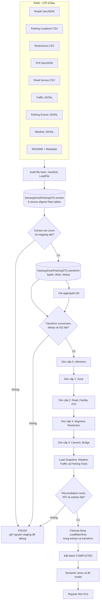

# Da Nang Smart Parking & Traffic Analytics

## 1. Mục tiêu tài liệu

Tài liệu này được lập sau khi đọc toàn bộ các file trong thư mục `danang_smart_parking_raw_7d`, gồm README, 8 nguồn RAW và 3 file metadata. Nội dung đi tuần tự từ việc hiểu dữ liệu gốc, kiểm tra chất lượng, xác định câu hỏi/báo cáo, thiết kế Summary Data Warehouse theo mô hình Dimension–Fact, viết DDL cho SQL Server/SSMS, mô tả diagram và cuối cùng là quy trình sẵn sàng ETL.

Phạm vi dữ liệu là mẫu 7 ngày từ `2026-08-05` đến `2026-08-11`, múi giờ `Asia/Ho_Chi_Minh`, tập trung vào lõi đô thị Đà Nẵng cũ. Đây là dữ liệu portfolio; phần lớn tọa độ, hình học, đo đạc, sự kiện giao thông, sự kiện đỗ xe và thời tiết theo giờ là synthetic hoặc approximate. Không được trình bày các chỉ số này như số liệu đo chính thức hay dùng trực tiếp cho quyết định chính sách.

## 2. Kết quả đọc toàn bộ dữ liệu RAW

### 2.1. Danh mục file đã đọc

| STT | File | Định dạng | Số bản ghi | Grain của một bản ghi | Khóa tự nhiên/chính |
|---:|---|---|---:|---|---|
| 1 | `README_DATA.md` | Markdown | 39 dòng | Mô tả toàn bộ bộ dữ liệu | Không áp dụng |
| 2 | `01_roads.geojson` | GeoJSON | 30 road feature | Một tuyến đường | `road_id` |
| 3 | `02_parking_locations.csv` | CSV UTF-8 BOM | 20 | Một cơ sở/địa điểm đỗ xe | `parking_id` |
| 4 | `03_parking_restrictions.csv` | CSV UTF-8 BOM | 18 | Một quy tắc hạn chế theo đường và khung giờ | `restriction_id` |
| 5 | `04_poi.geojson` | GeoJSON | 50 point feature | Một POI | `poi_id` |
| 6 | `05_road_survey.csv` | CSV UTF-8 BOM | 30 | Một kết quả khảo sát cho một đoạn đường | `segment_id` |
| 7 | `06_traffic_events.jsonl` | JSON Lines | 16.884 RAW; 16.800 sau khử trùng | Một quan sát camera/đoạn đường mỗi 15 phút | `event_id` |
| 8 | `07_parking_events.jsonl` | JSON Lines | 4.300 RAW; 4.283 sau khử trùng | Một phiên đỗ xe ven đường | `event_id` |
| 9 | `08_weather_events.jsonl` | JSON Lines | 168 | Một quan sát thời tiết thành phố mỗi giờ | `timestamp` |
| 10 | `dataset_summary.json` | JSON | 1 object | Chỉ số kiểm kê do bộ sinh dữ liệu tạo | Không áp dụng |
| 11 | `generation_assumptions.json` | JSON | 1 object | Giả định sinh dữ liệu và nguồn tham chiếu | Không áp dụng |
| 12 | `source_manifest.csv` | CSV UTF-8 BOM | 8 | Một nguồn RAW | `source_id` |

Tổng cộng đã quét 23.357 dòng vật lý, khoảng 13,97 MB. Tất cả JSON/JSONL đều parse được; ba CSV có số cột nhất quán trên mọi dòng.

### 2.2. Nguồn `01_roads.geojson`

- 30 `LineString`, `road_id` từ `RD001` đến `RD030`, không null và không trùng.
- Tên của cả 30 đường là tên thật; hình học là `SYNTHETIC_APPROX`; chiều rộng là `SYNTHETIC_PLAUSIBLE`.
- 17 đường `primary`, 13 đường `secondary`; số làn chỉ có 4 hoặc 6; tốc độ giới hạn 50 hoặc 60 km/h.
- Chiều rộng 11,0–24,0 m; chiều dài 0,85–8,01 km; tổng chiều dài mẫu 82,22 km.
- Có 9 nhãn vùng phân tích trong road master. Các nhãn ghép như `Cẩm Lệ-Thanh Khê` hay `Sơn Trà-Ngũ Hành Sơn coast` phải được giữ nguyên như business key; không tự tách thành quận nếu không có mapping chính thức.

Các trường đã đọc và kiểu nguồn suy luận:

| Trường | Kiểu nguồn | Null | Ý nghĩa/sử dụng |
|---|---|---:|---|
| `road_id` | string | 0 | Business key của đường |
| `road_name` | Unicode string | 0 | Tên hiển thị |
| `analysis_zone` | Unicode string | 0 | Vùng phân tích |
| `road_class` | string | 0 | `primary`/`secondary` |
| `lanes` | integer | 0 | Số làn |
| `speed_limit_kmh` | integer | 0 | Giới hạn tốc độ |
| `road_width_m` | decimal | 0 | Chiều rộng master |
| `length_km` | decimal | 0 | Chiều dài tuyến |
| `city_population_reference` | integer | 0 | 3.065.628, là số tham chiếu bối cảnh |
| `name_status`, `geometry_status`, `width_status` | string | 0 | Nguồn gốc/chất lượng dữ liệu |
| `source_note` | Unicode string | 0 | Cảnh báo sử dụng |
| `geometry.coordinates` | array decimal | 0 | Cặp `[longitude, latitude]`, SRID 4326 khi nạp SQL Server |

### 2.3. Nguồn `02_parking_locations.csv`

- 20 địa điểm, tổng sức chứa ghi trong RAW là 2.267 chỗ, phạm vi 55–273 chỗ.
- Chỉ PK001 (273) và PK002 (124) có sức chứa tham chiếu thực, tổng 397 chỗ. 18 địa điểm còn lại có sức chứa synthetic.
- 2 địa điểm `OPERATIONAL_REFERENCE`, 7 `PLANNED_REFERENCE`, 11 `SYNTHETIC`.
- 9 tọa độ approximate, 11 vị trí synthetic gần hành lang đường thật; 11 dòng synthetic không có `source_url`.
- Không có `parking_id` trong `07_parking_events.jsonl`. Vì vậy không thể tính occupancy/utilization của bãi xe từ parking events; các event là đỗ xe ven đường, còn file này là inventory nguồn cung.

Các cột: `parking_id varchar`, `parking_name nvarchar`, `address_or_corridor nvarchar`, `analysis_zone nvarchar`, `capacity_spaces int`, `parking_type varchar`, `facility_status varchar`, `capacity_status varchar`, `coordinate_status nvarchar`, `latitude decimal`, `longitude decimal`, `source_url nvarchar nullable`.

### 2.4. Nguồn `03_parking_restrictions.csv`

- 18 quy tắc: 13 `NO_PARKING`, 4 `NO_STOPPING`, 1 `ODD_EVEN_NO_PARKING`.
- 10 áp dụng hai bên, 8 bên phải; 3 áp dụng mọi phương tiện, 15 cho `CAR_TRUCK`.
- 3 bản ghi `REAL_REFERENCE`; 15 bản ghi `SYNTHETIC_PLAUSIBLE`.
- R003 (`Doãn Khuê`) không có `road_id` và đường này không nằm trong road master. `RoadKey` của restriction này phải được để null/unknown, không gán nhầm theo tên.
- 17 dòng còn lại tham chiếu đúng road master và tên đường khớp hoàn toàn. Parking events dùng 13 trong 18 restriction ID; không có restriction ID mồ côi.

Các cột: `restriction_id varchar`, `road_id varchar nullable`, `road_name nvarchar`, `restriction_type varchar`, `start_time time`, `end_time time`, `side varchar`, `vehicle_scope varchar`, `data_status varchar`, `source_url nvarchar nullable`.

### 2.5. Nguồn `04_poi.geojson`

- 50 `Point`, 50 `poi_id` duy nhất, không null.
- 24 POI có tên thật nhưng tọa độ approximate; 26 POI synthetic.
- 18 nhóm category. Các nhóm lớn gồm `GOVERNMENT_SERVICE` 6, `HOSPITAL` 5, `RETAIL` 5, `SCHOOL` 5, `HOTEL` 4, `OFFICE` 4, `SHOPPING_MALL` 4.
- `parking_demand_weight` nằm trong 0,85–1,60. Đây là trọng số mô phỏng, không phải số lượt đỗ đo thực tế.
- Bounding box: longitude 108,153294–108,248092; latitude 16,013194–16,087105.

Các trường: `poi_id varchar`, `poi_name nvarchar`, `category varchar`, `analysis_zone nvarchar`, `parking_demand_weight decimal`, `data_status varchar`, và `geometry.coordinates` là `[longitude, latitude]`.

### 2.6. Nguồn `05_road_survey.csv`

- 30 segment, liên kết 1:1 với 30 road trong mẫu hiện tại; tất cả ID, tên đường và vùng đều khớp road master.
- Có đúng 3 null `road_width_m`: SEG_009, SEG_018, SEG_027. Có thể bổ sung giá trị từ road master ở Silver nhưng phải giữ cờ `WidthImputedFlag`.
- 17 segment 4 làn, 13 segment 6 làn; chiều rộng khảo sát không null nằm trong 10,4–23,4 m.
- `observed_parking_sides`: 8 BOTH, 9 LEFT, 9 RIGHT, 4 NONE.
- Tất cả là `SYNTHETIC_FIELD_SURVEY`, `quality_confidence = 0.85`.

Các cột: `segment_id varchar`, `road_id varchar`, `road_name nvarchar`, `analysis_zone nvarchar`, `road_width_m decimal nullable`, `lane_count int`, `sidewalk_width_m decimal`, `shoulder_width_m decimal`, `observed_parking_sides varchar`, `data_status varchar`, `quality_confidence decimal`.

### 2.7. Nguồn `06_traffic_events.jsonl`

- 16.884 dòng RAW; 16.800 `event_id` duy nhất. Có 84 nhóm trùng, mỗi nhóm dư đúng một dòng và payload trùng hoàn toàn.
- 25 đường RD001–RD025, 25 segment và 25 camera; mỗi đường có đủ 672 timestamp = 7 ngày × 96 khoảng 15 phút.
- Thời gian từ `2026-08-05T00:00:00` đến `2026-08-11T23:45:00`. `event_date`, `hour` và quarter-hour đều nhất quán.
- Không có road/segment/camera mồ côi; tên đường, vùng, chiều rộng master và lượng mưa theo giờ đều khớp nguồn liên quan.
- Sau khử trùng: 6.596.879 lượt phương tiện, tốc độ trung bình không trọng số 40,886 km/h, congestion index trung bình 0,25276, 30.480 parked observations và 9.100 illegal-parking observations.
- 161 dòng có `avg_speed_kmh = null` sau khử trùng; RAW có 165 vì 4 null bị lặp.
- 3.838 dòng sau khử trùng không thỏa `vehicle_count = motorbike + car + bus + truck`; tổng các thành phần lớn hơn total 45.369. Không được âm thầm tính lại total hoặc các thành phần; giữ nguyên và gắn cờ DQ.
- 781 dòng có `illegal_parking_count > parked_vehicle_count`; giữ nguyên và gắn cờ DQ.

Nhóm trường nguồn:

- Định danh/thời gian: `event_id string`, `timestamp datetime`, `event_date date`, `hour int`, `camera_id`, `segment_id`, `road_id`, `road_name`, `analysis_zone`.
- Định lượng giao thông: `vehicle_count`, `motorbike_count`, `car_count`, `bus_count`, `truck_count` là integer; `avg_speed_kmh decimal nullable`; `congestion_index decimal`.
- Định lượng đỗ xe trên mặt đường: `parked_vehicle_count`, `illegal_parking_count` integer; `parking_occupied_width_m`, `effective_width_m`, `width_loss_pct` decimal.
- Bối cảnh: `road_width_m decimal`, `rain_mm decimal`, `city_population_reference int`, `data_status string`, `generator_seed int`.
- Phạm vi quan sát: vehicle count 54–1.451; speed 19,5–57,0 km/h; congestion 0,05–0,643; width loss 0–35,09%; rain 0–8,1 mm.

### 2.8. Nguồn `07_parking_events.jsonl`

- 4.300 dòng RAW; 4.283 `event_id` duy nhất. Có 17 dòng lặp payload hoàn toàn.
- 20 đường RD001–RD020, 20 segment; tất cả liên kết road master hợp lệ. Các đường RD021–RD030 không có parking event.
- Sau khử trùng: 4.283 phiên, 1.571 phiên bất hợp pháp, tỷ lệ 36,68%, thời lượng trung bình 45,81 phút.
- `end_time` null ở 64 phiên; đây là phiên chưa đóng/ongoing. `parking_duration_min` vẫn có giá trị ở các dòng này nên chỉ được coi là planned/last-known duration, không phải thời lượng hoàn tất.
- `active_restriction_id` null ở 3.319 phiên sau khử trùng. Có 607 phiên `legal_parking = false` nhưng không có restriction được liên kết. Cần `RestrictionLinkMissingFlag`, không tự đổi thành legal.
- 964 event sau khử trùng có restriction link; tất cả ID được tham chiếu đều tồn tại.
- Loại xe RAW: CAR, SUV, VAN, LIGHT_TRUCK; side chỉ LEFT/RIGHT; thời lượng 5–300 phút; occupied width 1,75–2,15 m.

Nhóm trường nguồn:

- Định danh: `event_id`, `vehicle_id` (đã ẩn danh), `road_id`, `segment_id`, `road_name`, `analysis_zone`.
- Thời gian: `start_time datetime2(6)`, `end_time datetime2(6) nullable`, `event_date date`.
- Phân loại: `vehicle_type`, `side`, `active_restriction_id nullable`, `data_status`.
- Định lượng/cờ: `parking_duration_min int`, `occupied_width_m decimal`, `legal_parking boolean`, `city_population_reference int`.

### 2.9. Nguồn `08_weather_events.jsonl`

- Đúng 168 giờ, không null, không trùng, từ 00:00 ngày 05/08 đến 23:00 ngày 11/08.
- Nhiệt độ 27,1–37,1°C; humidity 55,0–85,3%; visibility 6,0–10,5 km; wind 1,5–20,7 km/h.
- Tổng `rain_mm` theo giờ là 47,5 mm trên 11 giờ mưa.
- `daily_min_c_actual`, `daily_max_c_actual`, `daily_reference_c_actual` là tham chiếu ngày; nhiệt độ theo giờ, mưa, ẩm, gió và visibility là synthetic.
- Tất cả `rain_mm` trong traffic event khớp weather của hour bucket tương ứng.

Các trường: `timestamp datetime2`, `event_date date`, `hour int`, `temperature_c`, `daily_min_c_actual`, `daily_max_c_actual`, `daily_reference_c_actual`, `rain_mm`, `humidity_pct`, `visibility_km`, `wind_kmh` là decimal; ba trường status/source là string.

### 2.10. Metadata và giả định sinh dữ liệu

- `dataset_summary.json` là bản tổng hợp trên RAW chưa khử trùng. Ví dụ total vehicle 6.628.928 khác total chuẩn Silver 6.596.879; báo cáo Summary phải dùng số sau khử trùng.
- `generation_assumptions.json` xác nhận interval 15 phút, 25 road có traffic, peak ngày thường 07:00–09:00 và 16:00–19:00, parking peak 11:00–14:00 và 16:00–19:00, cùng seed/gợi ý mô phỏng.
- `source_manifest.csv` xác nhận record count và ranh giới real/synthetic cho 8 nguồn.
- Bối cảnh dân số hiện tại 3.065.628, diện tích 11.859,59 km², dân số Đà Nẵng cũ 1.318.481 chỉ dùng để mô tả phạm vi và calibration; không cộng lặp vào Fact.

## 3. Hồ sơ chất lượng và quy tắc Silver

| Quy tắc | Kết quả phát hiện | Xử lý đề xuất |
|---|---:|---|
| Traffic duplicate theo `event_id` | 84 dòng dư | Giữ dòng có `SourceRowNumber` nhỏ nhất; vì payload giống hoàn toàn |
| Parking duplicate theo `event_id` | 17 dòng dư | Giữ dòng đầu tiên theo `SourceRowNumber` |
| Traffic `avg_speed_kmh` null | 161/16.800 sau dedup | Giữ null trong Fact; đặt `SpeedMissingFlag=1`; không điền 0 |
| Survey width null | 3/30 | Giữ raw null; tạo `RoadWidthResolvedM` từ road master và `WidthImputedFlag=1` |
| Parking `end_time` null | 64/4.283 | Giữ null; `IsOpenEvent=1`; không xem duration là completed duration |
| Vehicle component không bằng total | 3.838/16.800 | Giữ cả hai; `VehicleMixValidFlag=0`; KPI tổng lưu lượng dùng `vehicle_count` |
| Traffic illegal count lớn hơn parked count | 781/16.800 | Giữ raw; `ParkingCountValidFlag=0`; không dùng để kết luận tuân thủ nếu chưa lọc |
| Illegal parking event thiếu restriction link | 607/4.283 | `RestrictionLinkMissingFlag=1`; đưa vào DQ/review, không đổi nhãn legal |
| Restriction R003 thiếu road ID | 1/18 | Nạp restriction với `RoadKey=NULL`; không fuzzy-match |
| Road/name/zone/rain join | 0 mismatch | Đủ điều kiện dùng các business key hiện có |
| Coverage | Traffic chỉ RD001–RD025; parking chỉ RD001–RD020 | Hiển thị coverage trên báo cáo, không coi road không có event là zero thực tế |

Khóa dedup chuẩn là `event_id`, không dùng toàn bộ payload. Fact chỉ nhận bản ghi đã dedup; `extract` giữ đủ dòng của batch để debug cho tới khi reconciliation thành công. Nếu cần lưu payload vĩnh viễn sau cleanup, dùng thêm `bronze.RawRecord` như kho archive tùy chọn.

## 4. Danh mục báo cáo, tiêu chí và định lượng

### 4.1. Ma trận báo cáo

| ID | Báo cáo và mục đích | Tiêu chí/Dimension | Thuộc tính lọc/hiển thị | Định lượng/KPI | Fact/nguồn chính |
|---|---|---|---|---|---|
| R01 | Executive overview 7 ngày: bức tranh giao thông, đỗ xe, thời tiết và coverage | Ngày, vùng, đường, time band | Ngày, weekday/weekend, zone, road class, data status | Sum vehicle, avg/weighted speed, avg/max congestion, parking event, illegal rate, open event, rain total | Traffic + ParkingEvent + WeatherHourly |
| R02 | Xu hướng lưu lượng theo thời gian | Ngày → giờ → 15 phút; vùng → đường → segment → camera | Date, day name, hour, peak flag, zone, road class | Vehicle/motorbike/car/bus/truck count; tỷ trọng từng loại; growth so với interval trước | TrafficObservation |
| R03 | Hotspot ùn tắc và tốc độ thấp | Ngày/giờ, vùng/đường/segment/camera, thời tiết | Peak/off-peak, rain band, road width, speed limit | Avg/max congestion; số interval congestion ≥ ngưỡng; avg/min speed; vehicle-weighted speed | TrafficObservation |
| R04 | Áp lực đỗ ven đường lên năng lực giao thông | Thời gian, road/segment, observed parking side | Road width, effective width, side, road class | Parked/illegal observed count; occupied width; width loss%; tương quan width loss–speed–congestion | TrafficObservation + RoadSurveySnapshot |
| R05 | Tuân thủ hạn chế đỗ xe | Ngày/giờ, road/segment, restriction, vehicle type, side | Restriction type/time window/scope/status; legal flag | Parking events; illegal events; illegal rate; duration; event thiếu restriction link | ParkingEvent |
| R06 | Thời lượng và turnover đỗ xe ven đường | Ngày/time band, zone/road/segment, vehicle type, side | Open/closed event, legal status | Count event; avg/median/P90 duration; event/road/day; occupied-width-minutes | ParkingEvent |
| R07 | Inventory và năng lực bãi đỗ | Snapshot date, zone, facility type/status | Facility, address, real/synthetic capacity status, coordinate status | Capacity spaces; count facility; capacity theo status/zone/type | ParkingCapacitySnapshot |
| R08 | Đặc tính hạ tầng đường và khả năng bố trí đỗ | Snapshot date, zone/road/segment | Lane count, observed side, source status, imputed flag | Road/sidewalk/shoulder width; confidence; segment count; width missing rate | RoadSurveySnapshot + Road dimensions |
| R09 | Phân bố POI và chỉ báo nhu cầu đỗ | Zone, POI category, POI | Real/synthetic status, approximate coordinate | POI count; sum/avg demand weight; capacity lân cận theo zone; optional proximity distance | POI dimensions + Facility; optional RoadPOI bridge |
| R10 | Ảnh hưởng thời tiết đến giao thông | Ngày/hour, weather band, zone/road | Rainy/dry, temperature band, visibility band, peak flag | Avg congestion/speed/volume ở mưa và khô; change%; rain total | WeatherHourly + TrafficObservation qua DateKey/HourTimeKey |
| R11 | Data quality & ETL reconciliation | Batch, file, source row, rule | Load status, rejected reason, synthetic/real status | Read/accepted/rejected; duplicate count; null count; orphan count; reconciliation delta | ETL audit + cờ DQ trong Fact |

### 4.2. Công thức KPI bắt buộc thống nhất

1. `VehicleVolume = SUM(VehicleCount)`; sau dedup. Không lấy tổng bốn vehicle component vì nguồn đang lệch.
2. `AvgSpeed = AVG(AvgSpeedKmh)` bỏ qua null. Khi cần đại diện cho lưu lượng, dùng `WeightedAvgSpeed = SUM(AvgSpeedKmh * VehicleCount) / SUM(VehicleCount)` trên các dòng speed không null.
3. `IllegalParkingEventRate = SUM(CASE WHEN IsLegal=0 THEN 1 ELSE 0 END) / COUNT(*)`; có thể báo cáo thêm rate chỉ trên event có restriction link.
4. `CompletedAvgDuration` chỉ tính event có `EndTimestamp IS NOT NULL`.
5. `OccupiedWidthMinutes = OccupiedWidthM * ParkingDurationMin`; với open event phải gắn nhãn estimate.
6. `WidthLossPct` dùng giá trị event đã sinh; nếu tính lại thì `(RoadWidthM - EffectiveWidthM) / RoadWidthM * 100` và phải so sai số làm tròn.
7. `CongestedIntervalCount` dùng threshold do người dùng cấu hình, mặc định gợi ý `CongestionIndex >= 0.50`; không diễn giải threshold này là chuẩn chính thức.
8. Weather–traffic join bằng `(DateKey, HourTimeKey)`, không join trực tiếp quarter-minute với weather timestamp.
9. Capacity 2.267 chỉ là tổng inventory RAW; mọi visual phải tách `REAL_CAPACITY*` và `SYNTHETIC_CAPACITY`.
10. Không có KPI facility occupancy/utilization vì parking event không chứa `parking_id`.

### 4.3. Các câu hỏi có thể khai thác

- Khung 15 phút nào có volume và congestion cao nhất theo từng zone/road?
- Peak sáng và peak chiều khác nhau thế nào về volume, speed và vehicle mix?
- Cuối tuần có giảm giao thông CBD và tăng tại hành lang ven biển như giả định sinh dữ liệu không?
- Đường nào thường xuyên có congestion index trên 0,50?
- Mưa làm thay đổi speed, volume, congestion bao nhiêu sau khi kiểm soát time band?
- Width loss tăng có đi cùng speed giảm hoặc congestion tăng không?
- Loại đường primary/secondary có độ nhạy khác nhau với parked vehicle không?
- Đường, khung giờ, loại xe và side nào có tỷ lệ parking event bất hợp pháp cao nhất?
- Restriction type nào đi kèm nhiều vi phạm nhất? Kết quả thay đổi ra sao khi chỉ giữ restriction `REAL_REFERENCE`?
- Có bao nhiêu vi phạm không truy vết được restriction và tập trung ở đâu?
- Duration của event legal và illegal khác nhau thế nào? P50/P90 là bao nhiêu?
- Loại xe nào chiếm nhiều occupied-width-minutes nhất?
- Bao nhiêu event vẫn mở và chúng phân bố theo ngày/đường nào?
- Zone nào có nhiều facility/capacity nhất; tỷ lệ capacity thực và synthetic là bao nhiêu?
- Nguồn cung facility theo zone có tương xứng với tổng demand weight của POI không?
- Nhóm POI nào tập trung trong zone có áp lực parking cao?
- Segment nào thiếu road width hoặc có confidence cần theo dõi?
- Chênh lệch width giữa road master và survey là bao nhiêu?
- Coverage dữ liệu có đủ trên tất cả road không; road nào hoàn toàn chưa có traffic/parking event?
- Chỉ số dashboard thay đổi bao nhiêu trước và sau dedup?

## 5. Thiết kế Summary Data Warehouse

### 5.1. Chọn schema

Mô hình chính là **snowflake schema có conformed dimensions**. Phân cấp không gian được chuẩn hóa:

`City → AnalysisZone → Road → RoadSegment → Camera`

Các nhánh khác:

- `AnalysisZone → ParkingFacility`
- `AnalysisZone → POI`; `POICategory → POI`
- `Road → ParkingRestriction`
- `Road ↔ POI` qua bridge proximity tùy chọn
- `Date` và `Time` được dùng chung cho mọi Fact; `Time` đóng hai vai trò event time và hour bucket.

Snowflake phù hợp vì zone, road, segment và camera có phân cấp rõ, tránh lặp tên vùng/tên đường trên hàng triệu fact row. Đổi lại báo cáo cần nhiều join hơn; index khóa ngoại và semantic view sẽ xử lý chi phí này.

### 5.2. Grain và quyết định gộp/tách Fact

| Fact | Grain | Báo cáo dùng chung | Quyết định |
|---|---|---|---|
| `FactTrafficObservation` | Một `event_id`/camera/segment/15 phút sau dedup | R01–R04, R10 | Gộp volume, vehicle mix, speed, congestion và width-pressure vì cùng một RAW row, cùng grain, cùng dimensions |
| `FactParkingEvent` | Một phiên đỗ ven đường sau dedup | R01, R05, R06 | Tách khỏi traffic vì grain là event cá thể, thời điểm bất quy tắc; gộp sẽ tạo fan-out và double count |
| `FactWeatherHourly` | Một giờ của toàn thành phố | R01, R10 | Tách vì weather là hourly/city grain; nhét vào traffic sẽ lặp 25 road × 4 interval mỗi giờ |
| `FactParkingCapacitySnapshot` | Một facility tại một snapshot date | R07, R09 | Tách supply khỏi roadside event; capacity là semi-additive theo thời gian |
| `FactRoadSurveySnapshot` | Một segment tại một survey/load snapshot | R04, R08 | Tách đo đạc thay đổi theo kỳ khỏi dimension nhận diện segment |

Không gộp năm Fact trên. Chúng chỉ kết hợp ở semantic/report layer thông qua conformed dimensions hoặc aggregate cùng grain. Việc gộp vật lý sẽ làm tăng tính toán, sai additive behavior và tạo nhân bản số liệu.

### 5.3. Danh mục Dimension

| Dimension | Business key | Nguồn | Thuộc tính chính | Phân cấp/vai trò |
|---|---|---|---|---|
| `DimDate` | `DateValue` | Sinh bởi ETL | year, quarter, month, ISO weekday, weekend | Year → Quarter → Month → Date |
| `DimTime` | `TimeValue` theo phút | Sinh bởi ETL | hour, minute, quarter-hour, time band, peak flag | Hour → Quarter → Minute |
| `DimCity` | `CityCode` | README/assumptions | name, population, area, scope | Gốc geography |
| `DimAnalysisZone` | nguyên văn `analysis_zone` | Union Road/Parking/POI/Event | zone name/type/coastal | City → Zone |
| `DimRoad` | `road_id` | Roads GeoJSON | name, class, lane, limit, width, length, geography, statuses | Zone → Road; SCD2 |
| `DimRoadSegment` | `segment_id` | Road survey | road key, source name, observed parking side, status | Road → Segment; SCD2 |
| `DimCamera` | `camera_id` | Distinct traffic | segment key, status | Segment → Camera |
| `DimRoadSide` | side code | Seed + restriction/event | LEFT, RIGHT, BOTH, NONE | Conformed lookup |
| `DimParkingRestriction` | `restriction_id` | Restrictions | road, type, time window, side, scope, provenance | Road → Restriction; SCD2 |
| `DimVehicleType` | `vehicle_type` | Distinct parking event | type code/name/group | Parking slice |
| `DimParkingFacility` | `parking_id` | Parking locations | name/address/zone/type/status/coordinate/source | Zone → Facility; SCD2 |
| `DimPOICategory` | `category` | Distinct POI | category code/name | Category → POI |
| `DimPOI` | `poi_id` | POI GeoJSON | name/category/zone/demand weight/point/status | Zone và Category → POI; SCD2 |
| `DimWeatherSource` | tổ hợp 3 trường provenance | Weather | temperature status, precipitation status, source | Provenance cho weather fact |

`vehicle_id` là định danh ẩn danh có cardinality gần bằng event nên để dạng degenerate dimension trong FactParkingEvent, không tạo DimVehicle. Các vehicle count của traffic được giữ dạng cột measure để không nhân grain lên bốn lần.

### 5.4. Foreign key của từng Fact

- `FactTrafficObservation`: DateKey, TimeKey, HourTimeKey, SegmentKey, CameraKey, LoadFileKey.
- `FactParkingEvent`: StartDateKey, StartTimeKey, EndDateKey nullable, EndTimeKey nullable, SegmentKey, VehicleTypeKey, RoadSideKey, RestrictionKey nullable, LoadFileKey.
- `FactWeatherHourly`: DateKey, TimeKey, WeatherSourceKey, LoadFileKey.
- `FactParkingCapacitySnapshot`: SnapshotDateKey, ParkingFacilityKey, LoadFileKey.
- `FactRoadSurveySnapshot`: SnapshotDateKey, SourceSurveyDateKey nullable, SegmentKey, LoadFileKey.

Mọi Fact dùng surrogate key để bảo vệ lịch sử. Business key của event vẫn có unique index để bảo đảm idempotent load.

## 6. Script T-SQL tạo Summary Data trên SSMS

Các script dưới đây dành cho SQL Server 2017+ và chạy tuần tự từ Script 00. Dùng `nvarchar` cho tên/ghi chú tiếng Việt; dùng `varchar` cho code/status ASCII; không dùng kiểu `text`/`ntext` đã deprecated. Tọa độ dùng `geography` SRID 4326. `GO` là batch separator của SSMS.

### Script 00 — Database và schema

```sql
IF DB_ID(N'DanangSmartParkingDW') IS NULL
BEGIN
    CREATE DATABASE DanangSmartParkingDW;
END;
GO

USE DanangSmartParkingDW;
GO

IF NOT EXISTS (SELECT 1 FROM sys.schemas WHERE name = N'etl')
    EXEC(N'CREATE SCHEMA etl AUTHORIZATION dbo;');
GO
IF NOT EXISTS (SELECT 1 FROM sys.schemas WHERE name = N'bronze')
    EXEC(N'CREATE SCHEMA bronze AUTHORIZATION dbo;');
GO
IF NOT EXISTS (SELECT 1 FROM sys.schemas WHERE name = N'dwh')
    EXEC(N'CREATE SCHEMA dwh AUTHORIZATION dbo;');
GO
IF NOT EXISTS (SELECT 1 FROM sys.schemas WHERE name = N'rpt')
    EXEC(N'CREATE SCHEMA rpt AUTHORIZATION dbo;');
GO
```

### Script 01 — Audit batch, file, reject và optional Bronze archive

```sql
CREATE TABLE etl.LoadBatch
(
    LoadBatchKey       bigint IDENTITY(1,1) NOT NULL,
    BatchID            uniqueidentifier NOT NULL
        CONSTRAINT DF_LoadBatch_BatchID DEFAULT NEWSEQUENTIALID(),
    SourceFolder       nvarchar(500) NOT NULL,
    DatasetPeriodStart date NULL,
    DatasetPeriodEnd   date NULL,
    StartedAt          datetime2(3) NOT NULL
        CONSTRAINT DF_LoadBatch_StartedAt DEFAULT SYSUTCDATETIME(),
    CompletedAt        datetime2(3) NULL,
    LoadStatus         varchar(20) NOT NULL
        CONSTRAINT DF_LoadBatch_Status DEFAULT 'STARTED',
    RowsRead           bigint NOT NULL CONSTRAINT DF_LoadBatch_Read DEFAULT 0,
    RowsAccepted       bigint NOT NULL CONSTRAINT DF_LoadBatch_Accepted DEFAULT 0,
    RowsRejected       bigint NOT NULL CONSTRAINT DF_LoadBatch_Rejected DEFAULT 0,
    ErrorMessage       nvarchar(2000) NULL,
    CONSTRAINT PK_LoadBatch PRIMARY KEY CLUSTERED (LoadBatchKey),
    CONSTRAINT UQ_LoadBatch_BatchID UNIQUE (BatchID),
    CONSTRAINT CK_LoadBatch_Status CHECK
        (LoadStatus IN ('STARTED','BRONZE_LOADED','SILVER_VALIDATED','COMPLETED','FAILED')),
    CONSTRAINT CK_LoadBatch_Period CHECK
        (DatasetPeriodEnd IS NULL OR DatasetPeriodStart IS NULL
         OR DatasetPeriodEnd >= DatasetPeriodStart),
    CONSTRAINT CK_LoadBatch_Counts CHECK
        (RowsRead >= 0 AND RowsAccepted >= 0 AND RowsRejected >= 0)
);
GO

CREATE TABLE etl.LoadFile
(
    LoadFileKey        bigint IDENTITY(1,1) NOT NULL,
    LoadBatchKey       bigint NOT NULL,
    SourceID           char(2) NOT NULL,
    FileName           nvarchar(260) NOT NULL,
    FileFormat         varchar(20) NOT NULL,
    ExpectedRowCount   bigint NULL,
    ActualRowCount     bigint NULL,
    AcceptedRowCount   bigint NULL,
    RejectedRowCount   bigint NULL,
    FileHashSHA256     binary(32) NULL,
    StartedAt          datetime2(3) NOT NULL
        CONSTRAINT DF_LoadFile_StartedAt DEFAULT SYSUTCDATETIME(),
    CompletedAt        datetime2(3) NULL,
    LoadStatus         varchar(20) NOT NULL
        CONSTRAINT DF_LoadFile_Status DEFAULT 'STARTED',
    CONSTRAINT PK_LoadFile PRIMARY KEY CLUSTERED (LoadFileKey),
    CONSTRAINT FK_LoadFile_LoadBatch FOREIGN KEY (LoadBatchKey)
        REFERENCES etl.LoadBatch(LoadBatchKey),
    CONSTRAINT UQ_LoadFile_Batch_File UNIQUE (LoadBatchKey, FileName),
    CONSTRAINT CK_LoadFile_Format CHECK
        (FileFormat IN ('CSV','JSONL','GEOJSON','JSON','MARKDOWN')),
    CONSTRAINT CK_LoadFile_Status CHECK
        (LoadStatus IN ('STARTED','LOADED','VALIDATED','COMPLETED','FAILED'))
);
GO

CREATE TABLE bronze.RawRecord
(
    RawRecordKey       bigint IDENTITY(1,1) NOT NULL,
    LoadFileKey        bigint NOT NULL,
    SourceRowNumber    bigint NOT NULL,
    BusinessKeyText    nvarchar(200) NULL,
    RawPayload         nvarchar(max) NOT NULL,
    RecordHashSHA256   binary(32) NOT NULL,
    IngestedAt         datetime2(3) NOT NULL
        CONSTRAINT DF_RawRecord_IngestedAt DEFAULT SYSUTCDATETIME(),
    ParseStatus        varchar(20) NOT NULL
        CONSTRAINT DF_RawRecord_ParseStatus DEFAULT 'NOT_PARSED',
    CONSTRAINT PK_RawRecord PRIMARY KEY CLUSTERED (RawRecordKey),
    CONSTRAINT FK_RawRecord_LoadFile FOREIGN KEY (LoadFileKey)
        REFERENCES etl.LoadFile(LoadFileKey),
    CONSTRAINT UQ_RawRecord_File_Row UNIQUE (LoadFileKey, SourceRowNumber),
    CONSTRAINT CK_RawRecord_RowNumber CHECK (SourceRowNumber > 0),
    CONSTRAINT CK_RawRecord_ParseStatus CHECK
        (ParseStatus IN ('NOT_PARSED','PARSED','REJECTED'))
);
GO

CREATE TABLE etl.RejectedRow
(
    RejectedRowKey     bigint IDENTITY(1,1) NOT NULL,
    LoadFileKey        bigint NOT NULL,
    RawRecordKey       bigint NULL,
    SourceRowNumber    bigint NULL,
    BusinessKeyText    nvarchar(200) NULL,
    RuleCode           varchar(50) NOT NULL,
    Severity           varchar(10) NOT NULL,
    Reason             nvarchar(1000) NOT NULL,
    RawPayload         nvarchar(max) NULL,
    RejectedAt         datetime2(3) NOT NULL
        CONSTRAINT DF_RejectedRow_At DEFAULT SYSUTCDATETIME(),
    CONSTRAINT PK_RejectedRow PRIMARY KEY CLUSTERED (RejectedRowKey),
    CONSTRAINT FK_RejectedRow_LoadFile FOREIGN KEY (LoadFileKey)
        REFERENCES etl.LoadFile(LoadFileKey),
    CONSTRAINT FK_RejectedRow_RawRecord FOREIGN KEY (RawRecordKey)
        REFERENCES bronze.RawRecord(RawRecordKey),
    CONSTRAINT CK_RejectedRow_Severity CHECK
        (Severity IN ('INFO','WARNING','ERROR'))
);
GO

CREATE INDEX IX_RawRecord_BusinessKey
    ON bronze.RawRecord(LoadFileKey, BusinessKeyText);
CREATE INDEX IX_RejectedRow_FileRule
    ON etl.RejectedRow(LoadFileKey, RuleCode);
GO
```

`bronze.RawRecord` là archive tùy chọn, không phải nguồn cho Transform trong quy trình mới. Nếu bật archive, `RawPayload` phải giữ nguyên Unicode; với CSV có BOM, ETL loại BOM khỏi tên cột đầu tiên nhưng không sửa nội dung bản ghi gốc.

### Script 02 — DimDate và DimTime

```sql
CREATE TABLE dwh.DimDate
(
    DateKey            int NOT NULL,              -- YYYYMMDD
    DateValue          date NOT NULL,
    CalendarYear       smallint NOT NULL,
    CalendarQuarter    tinyint NOT NULL,
    MonthNumber        tinyint NOT NULL,
    MonthName          nvarchar(20) NOT NULL,
    DayOfMonth         tinyint NOT NULL,
    ISOWeekNumber      tinyint NOT NULL,
    ISOWeekdayNumber   tinyint NOT NULL,           -- Monday = 1
    DayName            nvarchar(20) NOT NULL,
    IsWeekend          bit NOT NULL,
    CONSTRAINT PK_DimDate PRIMARY KEY CLUSTERED (DateKey),
    CONSTRAINT UQ_DimDate_DateValue UNIQUE (DateValue),
    CONSTRAINT CK_DimDate_Month CHECK (MonthNumber BETWEEN 1 AND 12),
    CONSTRAINT CK_DimDate_Quarter CHECK (CalendarQuarter BETWEEN 1 AND 4),
    CONSTRAINT CK_DimDate_Weekday CHECK (ISOWeekdayNumber BETWEEN 1 AND 7)
);
GO

CREATE TABLE dwh.DimTime
(
    TimeKey            smallint NOT NULL,          -- HHMM
    TimeValue          time(0) NOT NULL,
    Hour24             tinyint NOT NULL,
    MinuteNumber       tinyint NOT NULL,
    MinuteOfDay        smallint NOT NULL,
    QuarterOfHour      tinyint NOT NULL,
    TimeBand           nvarchar(30) NOT NULL,
    IsConfiguredPeak   bit NOT NULL,
    CONSTRAINT PK_DimTime PRIMARY KEY CLUSTERED (TimeKey),
    CONSTRAINT UQ_DimTime_TimeValue UNIQUE (TimeValue),
    CONSTRAINT UQ_DimTime_MinuteOfDay UNIQUE (MinuteOfDay),
    CONSTRAINT CK_DimTime_Hour CHECK (Hour24 BETWEEN 0 AND 23),
    CONSTRAINT CK_DimTime_Minute CHECK (MinuteNumber BETWEEN 0 AND 59),
    CONSTRAINT CK_DimTime_Quarter CHECK (QuarterOfHour BETWEEN 1 AND 4)
);
GO

DECLARE @StartDate date = '20260805', @EndDate date = '20260811';
;WITH DateSeries AS
(
    SELECT @StartDate AS d
    UNION ALL
    SELECT DATEADD(day, 1, d) FROM DateSeries WHERE d < @EndDate
)
INSERT dwh.DimDate
(
    DateKey, DateValue, CalendarYear, CalendarQuarter, MonthNumber,
    MonthName, DayOfMonth, ISOWeekNumber, ISOWeekdayNumber, DayName, IsWeekend
)
SELECT
    CONVERT(int, CONVERT(char(8), d, 112)), d, YEAR(d), DATEPART(quarter, d),
    MONTH(d), DATENAME(month, d), DAY(d), DATEPART(iso_week, d),
    (DATEDIFF(day, CONVERT(date,'19000101'), d) % 7) + 1,
    DATENAME(weekday, d),
    CASE WHEN (DATEDIFF(day, CONVERT(date,'19000101'), d) % 7) + 1 IN (6,7)
         THEN 1 ELSE 0 END
FROM DateSeries
WHERE NOT EXISTS (SELECT 1 FROM dwh.DimDate x WHERE x.DateValue = DateSeries.d)
OPTION (MAXRECURSION 0);
GO

;WITH MinuteSeries AS
(
    SELECT 0 AS n
    UNION ALL
    SELECT n + 1 FROM MinuteSeries WHERE n < 1439
)
INSERT dwh.DimTime
(
    TimeKey, TimeValue, Hour24, MinuteNumber, MinuteOfDay,
    QuarterOfHour, TimeBand, IsConfiguredPeak
)
SELECT
    (n / 60) * 100 + (n % 60),
    TIMEFROMPARTS(n / 60, n % 60, 0, 0, 0),
    n / 60, n % 60, n, ((n % 60) / 15) + 1,
    CASE
        WHEN n < 360 THEN N'Đêm'
        WHEN n < 660 THEN N'Sáng'
        WHEN n < 840 THEN N'Trưa'
        WHEN n < 960 THEN N'Chiều'
        WHEN n < 1140 THEN N'Cao điểm chiều'
        ELSE N'Tối'
    END,
    CASE WHEN n BETWEEN 420 AND 539 OR n BETWEEN 960 AND 1139
         THEN 1 ELSE 0 END
FROM MinuteSeries
WHERE NOT EXISTS
(
    SELECT 1 FROM dwh.DimTime t
    WHERE t.MinuteOfDay = MinuteSeries.n
)
OPTION (MAXRECURSION 1440);
GO
```

Khi ETL nhận ngày ngoài 05–11/08/2026, phải mở rộng DimDate trước khi nạp Fact. DimTime đã có đủ 1.440 phút để nhận timestamp bất quy tắc của parking event.

### Script 03 — DimCity, DimAnalysisZone và DimRoadSide

```sql
CREATE TABLE dwh.DimCity
(
    CityKey                    smallint IDENTITY(1,1) NOT NULL,
    CityCode                   varchar(20) NOT NULL,
    CityName                   nvarchar(100) NOT NULL,
    PopulationReference        int NULL,
    AreaKm2Reference           decimal(12,2) NULL,
    FormerPopulationReference  int NULL,
    ScopeNote                  nvarchar(1000) NULL,
    DataWarning                nvarchar(1000) NULL,
    CONSTRAINT PK_DimCity PRIMARY KEY CLUSTERED (CityKey),
    CONSTRAINT UQ_DimCity_Code UNIQUE (CityCode),
    CONSTRAINT CK_DimCity_Pop CHECK
        (PopulationReference IS NULL OR PopulationReference > 0),
    CONSTRAINT CK_DimCity_Area CHECK
        (AreaKm2Reference IS NULL OR AreaKm2Reference > 0)
);
GO

CREATE TABLE dwh.DimAnalysisZone
(
    ZoneKey            int IDENTITY(1,1) NOT NULL,
    ZoneBusinessKey    nvarchar(100) NOT NULL,
    ZoneName           nvarchar(100) NOT NULL,
    ZoneType           varchar(30) NOT NULL,
    IsCoastal          bit NOT NULL,
    CityKey            smallint NOT NULL,
    CONSTRAINT PK_DimAnalysisZone PRIMARY KEY CLUSTERED (ZoneKey),
    CONSTRAINT UQ_DimAnalysisZone_BK UNIQUE (ZoneBusinessKey),
    CONSTRAINT FK_DimAnalysisZone_City FOREIGN KEY (CityKey)
        REFERENCES dwh.DimCity(CityKey)
);
GO

CREATE TABLE dwh.DimRoadSide
(
    RoadSideKey        tinyint NOT NULL,
    SideCode           varchar(10) NOT NULL,
    SideName           nvarchar(30) NOT NULL,
    CONSTRAINT PK_DimRoadSide PRIMARY KEY CLUSTERED (RoadSideKey),
    CONSTRAINT UQ_DimRoadSide_Code UNIQUE (SideCode)
);
GO

INSERT dwh.DimRoadSide(RoadSideKey, SideCode, SideName)
SELECT v.RoadSideKey, v.SideCode, v.SideName
FROM (VALUES
    (0, 'UNKNOWN', N'Không xác định'),
    (1, 'LEFT',    N'Bên trái'),
    (2, 'RIGHT',   N'Bên phải'),
    (3, 'BOTH',    N'Cả hai bên'),
    (4, 'NONE',    N'Không quan sát đỗ')
) v(RoadSideKey, SideCode, SideName)
WHERE NOT EXISTS
(
    SELECT 1 FROM dwh.DimRoadSide d WHERE d.RoadSideKey = v.RoadSideKey
);
GO
```

Khi seed `DimCity`, dùng `CityCode='DANANG'`, `PopulationReference=3065628`, `AreaKm2Reference=11859.59`, `FormerPopulationReference=1318481`; đồng thời giữ cảnh báo scope từ README.

### Script 04 — DimRoad, DimRoadSegment và DimCamera

```sql
CREATE TABLE dwh.DimRoad
(
    RoadKey                    int IDENTITY(1,1) NOT NULL,
    RoadID                     varchar(10) NOT NULL,
    RoadName                   nvarchar(150) NOT NULL,
    ZoneKey                    int NOT NULL,
    RoadClass                  varchar(30) NOT NULL,
    LaneCount                  tinyint NOT NULL,
    SpeedLimitKmh              smallint NOT NULL,
    MasterRoadWidthM           decimal(6,2) NOT NULL,
    LengthKm                   decimal(8,3) NOT NULL,
    RoadGeography              geography NULL,
    NameStatus                 varchar(40) NOT NULL,
    GeometryStatus             varchar(50) NOT NULL,
    WidthStatus                varchar(50) NOT NULL,
    SourceNote                 nvarchar(1000) NULL,
    ValidFrom                  datetime2(3) NOT NULL,
    ValidTo                    datetime2(3) NULL,
    IsCurrent                  bit NOT NULL,
    AttributeHash              binary(32) NOT NULL,
    CONSTRAINT PK_DimRoad PRIMARY KEY CLUSTERED (RoadKey),
    CONSTRAINT FK_DimRoad_Zone FOREIGN KEY (ZoneKey)
        REFERENCES dwh.DimAnalysisZone(ZoneKey),
    CONSTRAINT CK_DimRoad_Lanes CHECK (LaneCount > 0),
    CONSTRAINT CK_DimRoad_Speed CHECK (SpeedLimitKmh > 0),
    CONSTRAINT CK_DimRoad_Width CHECK (MasterRoadWidthM > 0),
    CONSTRAINT CK_DimRoad_Length CHECK (LengthKm > 0),
    CONSTRAINT CK_DimRoad_Validity CHECK (ValidTo IS NULL OR ValidTo > ValidFrom)
);
GO

CREATE UNIQUE INDEX UX_DimRoad_Current
    ON dwh.DimRoad(RoadID) WHERE IsCurrent = 1;
CREATE INDEX IX_DimRoad_Zone ON dwh.DimRoad(ZoneKey, IsCurrent);
GO

CREATE TABLE dwh.DimRoadSegment
(
    SegmentKey                 int IDENTITY(1,1) NOT NULL,
    SegmentID                  varchar(20) NOT NULL,
    RoadKey                    int NOT NULL,
    SourceRoadName             nvarchar(150) NOT NULL,
    ObservedRoadSideKey        tinyint NOT NULL,
    SurveyDataStatus           varchar(50) NOT NULL,
    ValidFrom                  datetime2(3) NOT NULL,
    ValidTo                    datetime2(3) NULL,
    IsCurrent                  bit NOT NULL,
    AttributeHash              binary(32) NOT NULL,
    CONSTRAINT PK_DimRoadSegment PRIMARY KEY CLUSTERED (SegmentKey),
    CONSTRAINT FK_DimRoadSegment_Road FOREIGN KEY (RoadKey)
        REFERENCES dwh.DimRoad(RoadKey),
    CONSTRAINT FK_DimRoadSegment_Side FOREIGN KEY (ObservedRoadSideKey)
        REFERENCES dwh.DimRoadSide(RoadSideKey),
    CONSTRAINT CK_DimRoadSegment_Validity CHECK
        (ValidTo IS NULL OR ValidTo > ValidFrom)
);
GO

CREATE UNIQUE INDEX UX_DimRoadSegment_Current
    ON dwh.DimRoadSegment(SegmentID) WHERE IsCurrent = 1;
CREATE INDEX IX_DimRoadSegment_Road ON dwh.DimRoadSegment(RoadKey, IsCurrent);
GO

CREATE TABLE dwh.DimCamera
(
    CameraKey          int IDENTITY(1,1) NOT NULL,
    CameraID           varchar(20) NOT NULL,
    SegmentKey         int NOT NULL,
    CameraStatus       varchar(30) NOT NULL,
    ValidFrom          datetime2(3) NOT NULL,
    ValidTo            datetime2(3) NULL,
    IsCurrent          bit NOT NULL,
    AttributeHash      binary(32) NOT NULL,
    CONSTRAINT PK_DimCamera PRIMARY KEY CLUSTERED (CameraKey),
    CONSTRAINT FK_DimCamera_Segment FOREIGN KEY (SegmentKey)
        REFERENCES dwh.DimRoadSegment(SegmentKey),
    CONSTRAINT CK_DimCamera_Validity CHECK (ValidTo IS NULL OR ValidTo > ValidFrom)
);
GO

CREATE UNIQUE INDEX UX_DimCamera_Current
    ON dwh.DimCamera(CameraID) WHERE IsCurrent = 1;
CREATE INDEX IX_DimCamera_Segment ON dwh.DimCamera(SegmentKey, IsCurrent);
GO
```

`DimRoad`, `DimRoadSegment` và `DimCamera` dùng SCD Type 2. `AttributeHash` là SHA-256 của các thuộc tính business, dùng để phát hiện thay đổi; không đưa cột kỹ thuật như load timestamp vào hash.

### Script 05 — DimParkingRestriction và DimVehicleType

```sql
CREATE TABLE dwh.DimParkingRestriction
(
    RestrictionKey     int IDENTITY(1,1) NOT NULL,
    RestrictionID      varchar(20) NOT NULL,
    RoadKey            int NULL,
    SourceRoadName     nvarchar(150) NOT NULL,
    RestrictionType    varchar(40) NOT NULL,
    StartTime          time(0) NOT NULL,
    EndTime            time(0) NOT NULL,
    RoadSideKey        tinyint NOT NULL,
    VehicleScope       varchar(30) NOT NULL,
    DataStatus         varchar(50) NOT NULL,
    SourceURL          nvarchar(500) NULL,
    ValidFrom          datetime2(3) NOT NULL,
    ValidTo            datetime2(3) NULL,
    IsCurrent          bit NOT NULL,
    AttributeHash      binary(32) NOT NULL,
    CONSTRAINT PK_DimParkingRestriction PRIMARY KEY CLUSTERED (RestrictionKey),
    CONSTRAINT FK_DimParkingRestriction_Road FOREIGN KEY (RoadKey)
        REFERENCES dwh.DimRoad(RoadKey),
    CONSTRAINT FK_DimParkingRestriction_Side FOREIGN KEY (RoadSideKey)
        REFERENCES dwh.DimRoadSide(RoadSideKey),
    CONSTRAINT CK_DimParkingRestriction_Window CHECK (EndTime > StartTime),
    CONSTRAINT CK_DimParkingRestriction_Validity CHECK
        (ValidTo IS NULL OR ValidTo > ValidFrom)
);
GO

CREATE UNIQUE INDEX UX_DimParkingRestriction_Current
    ON dwh.DimParkingRestriction(RestrictionID) WHERE IsCurrent = 1;
CREATE INDEX IX_DimParkingRestriction_Road
    ON dwh.DimParkingRestriction(RoadKey, IsCurrent);
GO

CREATE TABLE dwh.DimVehicleType
(
    VehicleTypeKey     smallint NOT NULL,
    VehicleTypeCode    varchar(30) NOT NULL,
    VehicleTypeName    nvarchar(50) NOT NULL,
    VehicleGroup       varchar(30) NOT NULL,
    CONSTRAINT PK_DimVehicleType PRIMARY KEY CLUSTERED (VehicleTypeKey),
    CONSTRAINT UQ_DimVehicleType_Code UNIQUE (VehicleTypeCode)
);
GO

INSERT dwh.DimVehicleType
    (VehicleTypeKey, VehicleTypeCode, VehicleTypeName, VehicleGroup)
SELECT v.VehicleTypeKey, v.VehicleTypeCode, v.VehicleTypeName, v.VehicleGroup
FROM (VALUES
    (0, 'UNKNOWN',     N'Không xác định', N'UNKNOWN'),
    (1, 'CAR',         N'Ô tô con',        N'PASSENGER'),
    (2, 'SUV',         N'SUV',              N'PASSENGER'),
    (3, 'VAN',         N'Xe van',           N'LIGHT_COMMERCIAL'),
    (4, 'LIGHT_TRUCK', N'Xe tải nhẹ',       N'LIGHT_COMMERCIAL')
) v(VehicleTypeKey, VehicleTypeCode, VehicleTypeName, VehicleGroup)
WHERE NOT EXISTS
(
    SELECT 1 FROM dwh.DimVehicleType d
    WHERE d.VehicleTypeKey = v.VehicleTypeKey
);
GO
```

R003 được nạp với `RoadKey=NULL`. Constraint khung giờ hiện phù hợp toàn bộ 18 rule; nếu tương lai có rule qua nửa đêm, cần bổ sung `CrossMidnightFlag` thay vì dùng constraint này.

### Script 06 — DimParkingFacility

```sql
CREATE TABLE dwh.DimParkingFacility
(
    ParkingFacilityKey     int IDENTITY(1,1) NOT NULL,
    ParkingID              varchar(20) NOT NULL,
    ParkingName            nvarchar(200) NOT NULL,
    AddressOrCorridor      nvarchar(250) NOT NULL,
    ZoneKey                int NOT NULL,
    ParkingType            varchar(60) NOT NULL,
    FacilityStatus         varchar(50) NOT NULL,
    CapacityStatus         varchar(60) NOT NULL,
    CoordinateStatus       nvarchar(100) NOT NULL,
    Latitude               decimal(9,6) NOT NULL,
    Longitude              decimal(9,6) NOT NULL,
    FacilityPoint          geography NULL,
    SourceURL              nvarchar(500) NULL,
    ValidFrom              datetime2(3) NOT NULL,
    ValidTo                datetime2(3) NULL,
    IsCurrent              bit NOT NULL,
    AttributeHash          binary(32) NOT NULL,
    CONSTRAINT PK_DimParkingFacility PRIMARY KEY CLUSTERED (ParkingFacilityKey),
    CONSTRAINT FK_DimParkingFacility_Zone FOREIGN KEY (ZoneKey)
        REFERENCES dwh.DimAnalysisZone(ZoneKey),
    CONSTRAINT CK_DimParkingFacility_Lat CHECK (Latitude BETWEEN -90 AND 90),
    CONSTRAINT CK_DimParkingFacility_Lon CHECK (Longitude BETWEEN -180 AND 180),
    CONSTRAINT CK_DimParkingFacility_Validity CHECK
        (ValidTo IS NULL OR ValidTo > ValidFrom)
);
GO

CREATE UNIQUE INDEX UX_DimParkingFacility_Current
    ON dwh.DimParkingFacility(ParkingID) WHERE IsCurrent = 1;
CREATE INDEX IX_DimParkingFacility_Zone
    ON dwh.DimParkingFacility(ZoneKey, IsCurrent);
GO
```

`FacilityPoint` được tạo bằng `geography::Point(Latitude, Longitude, 4326)`. Không tạo FK từ parking event sang facility vì RAW không có quan hệ đó.

### Script 07 — DimPOICategory, DimPOI, DimWeatherSource và bridge Road–POI

```sql
CREATE TABLE dwh.DimPOICategory
(
    POICategoryKey     smallint IDENTITY(1,1) NOT NULL,
    CategoryCode       varchar(50) NOT NULL,
    CategoryName       nvarchar(100) NOT NULL,
    CONSTRAINT PK_DimPOICategory PRIMARY KEY CLUSTERED (POICategoryKey),
    CONSTRAINT UQ_DimPOICategory_Code UNIQUE (CategoryCode)
);
GO

CREATE TABLE dwh.DimPOI
(
    POIKey                 int IDENTITY(1,1) NOT NULL,
    POIID                  varchar(20) NOT NULL,
    POIName                nvarchar(200) NOT NULL,
    POICategoryKey         smallint NOT NULL,
    ZoneKey                int NOT NULL,
    ParkingDemandWeight    decimal(6,3) NOT NULL,
    Latitude               decimal(9,6) NOT NULL,
    Longitude              decimal(9,6) NOT NULL,
    POIPoint               geography NULL,
    DataStatus             varchar(50) NOT NULL,
    ValidFrom              datetime2(3) NOT NULL,
    ValidTo                datetime2(3) NULL,
    IsCurrent              bit NOT NULL,
    AttributeHash          binary(32) NOT NULL,
    CONSTRAINT PK_DimPOI PRIMARY KEY CLUSTERED (POIKey),
    CONSTRAINT FK_DimPOI_Category FOREIGN KEY (POICategoryKey)
        REFERENCES dwh.DimPOICategory(POICategoryKey),
    CONSTRAINT FK_DimPOI_Zone FOREIGN KEY (ZoneKey)
        REFERENCES dwh.DimAnalysisZone(ZoneKey),
    CONSTRAINT CK_DimPOI_Weight CHECK (ParkingDemandWeight > 0),
    CONSTRAINT CK_DimPOI_Lat CHECK (Latitude BETWEEN -90 AND 90),
    CONSTRAINT CK_DimPOI_Lon CHECK (Longitude BETWEEN -180 AND 180),
    CONSTRAINT CK_DimPOI_Validity CHECK (ValidTo IS NULL OR ValidTo > ValidFrom)
);
GO

CREATE UNIQUE INDEX UX_DimPOI_Current
    ON dwh.DimPOI(POIID) WHERE IsCurrent = 1;
CREATE INDEX IX_DimPOI_ZoneCategory
    ON dwh.DimPOI(ZoneKey, POICategoryKey, IsCurrent);
GO

CREATE TABLE dwh.DimWeatherSource
(
    WeatherSourceKey       smallint IDENTITY(1,1) NOT NULL,
    TemperatureStatus      varchar(80) NOT NULL,
    PrecipitationStatus    varchar(40) NOT NULL,
    SourceReference        nvarchar(300) NOT NULL,
    CONSTRAINT PK_DimWeatherSource PRIMARY KEY CLUSTERED (WeatherSourceKey),
    CONSTRAINT UQ_DimWeatherSource UNIQUE
        (TemperatureStatus, PrecipitationStatus, SourceReference)
);
GO

CREATE TABLE dwh.BridgeRoadPOI
(
    RoadKey              int NOT NULL,
    POIKey               int NOT NULL,
    DistanceMeters       decimal(12,2) NOT NULL,
    InfluenceWeight      decimal(9,6) NOT NULL,
    AllocationWeight     decimal(9,6) NOT NULL,
    ProximityMethod      varchar(40) NOT NULL,
    LoadBatchKey         bigint NOT NULL,
    CalculatedAt         datetime2(3) NOT NULL
        CONSTRAINT DF_BridgeRoadPOI_At DEFAULT SYSUTCDATETIME(),
    CONSTRAINT PK_BridgeRoadPOI PRIMARY KEY CLUSTERED (RoadKey, POIKey),
    CONSTRAINT FK_BridgeRoadPOI_Road FOREIGN KEY (RoadKey)
        REFERENCES dwh.DimRoad(RoadKey),
    CONSTRAINT FK_BridgeRoadPOI_POI FOREIGN KEY (POIKey)
        REFERENCES dwh.DimPOI(POIKey),
    CONSTRAINT FK_BridgeRoadPOI_Batch FOREIGN KEY (LoadBatchKey)
        REFERENCES etl.LoadBatch(LoadBatchKey),
    CONSTRAINT CK_BridgeRoadPOI_Distance CHECK (DistanceMeters >= 0),
    CONSTRAINT CK_BridgeRoadPOI_Influence CHECK (InfluenceWeight >= 0),
    CONSTRAINT CK_BridgeRoadPOI_Allocation CHECK
        (AllocationWeight >= 0 AND AllocationWeight <= 1)
);
GO

CREATE INDEX IX_BridgeRoadPOI_POI ON dwh.BridgeRoadPOI(POIKey, RoadKey);
GO
```

Bridge là enrichment tùy chọn, không phải quan hệ trực tiếp có sẵn trong RAW. Chỉ tạo cặp road–POI trong một bán kính đã cấu hình, tính `DistanceMeters` bằng geography, rồi chuẩn hóa `AllocationWeight` sao cho tổng theo RoadKey bằng 1. Khi cộng vehicle qua nhiều POI phải dùng allocation weight để tránh double count. Vì cả road geometry và POI coordinate đều approximate/synthetic, mọi báo cáo proximity phải hiển thị cảnh báo.

### Script 08 — FactTrafficObservation

```sql
CREATE TABLE dwh.FactTrafficObservation
(
    TrafficFactKey             bigint IDENTITY(1,1) NOT NULL,
    EventID                    varchar(50) NOT NULL,
    DateKey                    int NOT NULL,
    TimeKey                    smallint NOT NULL,
    HourTimeKey                smallint NOT NULL,
    SegmentKey                 int NOT NULL,
    CameraKey                  int NOT NULL,
    EventTimestamp             datetime2(0) NOT NULL,
    VehicleCount               int NOT NULL,
    MotorbikeCount             int NOT NULL,
    CarCount                   int NOT NULL,
    BusCount                   int NOT NULL,
    TruckCount                 int NOT NULL,
    AvgSpeedKmh                decimal(6,2) NULL,
    ParkedVehicleCount         smallint NOT NULL,
    IllegalParkingCount        smallint NOT NULL,
    RoadWidthM                 decimal(6,2) NOT NULL,
    ParkingOccupiedWidthM      decimal(6,2) NOT NULL,
    EffectiveWidthM            decimal(6,2) NOT NULL,
    WidthLossPct               decimal(6,2) NOT NULL,
    CongestionIndex            decimal(7,4) NOT NULL,
    RainMm                     decimal(7,2) NOT NULL,
    SpeedMissingFlag           bit NOT NULL,
    VehicleMixValidFlag        bit NOT NULL,
    ParkingCountValidFlag      bit NOT NULL,
    LoadFileKey                bigint NOT NULL,
    SourceRowNumber            bigint NOT NULL,
    RecordHashSHA256           binary(32) NOT NULL,
    LoadedAt                   datetime2(3) NOT NULL
        CONSTRAINT DF_FactTraffic_LoadedAt DEFAULT SYSUTCDATETIME(),
    CONSTRAINT PK_FactTrafficObservation PRIMARY KEY CLUSTERED (TrafficFactKey),
    CONSTRAINT UQ_FactTraffic_EventID UNIQUE (EventID),
    CONSTRAINT FK_FactTraffic_Date FOREIGN KEY (DateKey)
        REFERENCES dwh.DimDate(DateKey),
    CONSTRAINT FK_FactTraffic_Time FOREIGN KEY (TimeKey)
        REFERENCES dwh.DimTime(TimeKey),
    CONSTRAINT FK_FactTraffic_HourTime FOREIGN KEY (HourTimeKey)
        REFERENCES dwh.DimTime(TimeKey),
    CONSTRAINT FK_FactTraffic_Segment FOREIGN KEY (SegmentKey)
        REFERENCES dwh.DimRoadSegment(SegmentKey),
    CONSTRAINT FK_FactTraffic_Camera FOREIGN KEY (CameraKey)
        REFERENCES dwh.DimCamera(CameraKey),
    CONSTRAINT FK_FactTraffic_LoadFile FOREIGN KEY (LoadFileKey)
        REFERENCES etl.LoadFile(LoadFileKey),
    CONSTRAINT CK_FactTraffic_Counts CHECK
        (VehicleCount >= 0 AND MotorbikeCount >= 0 AND CarCount >= 0
         AND BusCount >= 0 AND TruckCount >= 0
         AND ParkedVehicleCount >= 0 AND IllegalParkingCount >= 0),
    CONSTRAINT CK_FactTraffic_Speed CHECK (AvgSpeedKmh IS NULL OR AvgSpeedKmh >= 0),
    CONSTRAINT CK_FactTraffic_Widths CHECK
        (RoadWidthM > 0 AND ParkingOccupiedWidthM >= 0 AND EffectiveWidthM > 0),
    CONSTRAINT CK_FactTraffic_Rates CHECK
        (WidthLossPct >= 0 AND CongestionIndex >= 0 AND RainMm >= 0),
    CONSTRAINT CK_FactTraffic_SpeedFlag CHECK
        ((AvgSpeedKmh IS NULL AND SpeedMissingFlag = 1)
         OR (AvgSpeedKmh IS NOT NULL AND SpeedMissingFlag = 0)),
    CONSTRAINT CK_FactTraffic_RowNumber CHECK (SourceRowNumber > 0)
);
GO

CREATE INDEX IX_FactTraffic_DateHour
    ON dwh.FactTrafficObservation(DateKey, HourTimeKey)
    INCLUDE (VehicleCount, AvgSpeedKmh, CongestionIndex, RainMm);
CREATE INDEX IX_FactTraffic_SegmentDateTime
    ON dwh.FactTrafficObservation(SegmentKey, DateKey, TimeKey)
    INCLUDE (VehicleCount, AvgSpeedKmh, CongestionIndex, WidthLossPct);
CREATE INDEX IX_FactTraffic_CameraTime
    ON dwh.FactTrafficObservation(CameraKey, EventTimestamp);
GO
```

Không đặt hard constraint cho tổng vehicle component hay `IllegalParkingCount <= ParkedVehicleCount` vì RAW đang vi phạm; hai cờ valid phục vụ lọc và data-quality report.

### Script 09 — FactParkingEvent

```sql
CREATE TABLE dwh.FactParkingEvent
(
    ParkingEventFactKey        bigint IDENTITY(1,1) NOT NULL,
    EventID                    varchar(30) NOT NULL,
    VehicleID                  varchar(30) NOT NULL,
    StartDateKey               int NOT NULL,
    StartTimeKey               smallint NOT NULL,
    EndDateKey                 int NULL,
    EndTimeKey                 smallint NULL,
    SegmentKey                 int NOT NULL,
    VehicleTypeKey             smallint NOT NULL,
    RoadSideKey                tinyint NOT NULL,
    RestrictionKey             int NULL,
    StartTimestamp             datetime2(6) NOT NULL,
    EndTimestamp               datetime2(6) NULL,
    ParkingDurationMin         smallint NOT NULL,
    OccupiedWidthM             decimal(5,2) NOT NULL,
    IsLegalParking             bit NOT NULL,
    IsOpenEvent                bit NOT NULL,
    IsDurationEstimated        bit NOT NULL,
    RestrictionLinkMissingFlag bit NOT NULL,
    LoadFileKey                bigint NOT NULL,
    SourceRowNumber            bigint NOT NULL,
    RecordHashSHA256           binary(32) NOT NULL,
    LoadedAt                   datetime2(3) NOT NULL
        CONSTRAINT DF_FactParkingEvent_LoadedAt DEFAULT SYSUTCDATETIME(),
    CONSTRAINT PK_FactParkingEvent PRIMARY KEY CLUSTERED (ParkingEventFactKey),
    CONSTRAINT UQ_FactParkingEvent_EventID UNIQUE (EventID),
    CONSTRAINT FK_FactParkingEvent_StartDate FOREIGN KEY (StartDateKey)
        REFERENCES dwh.DimDate(DateKey),
    CONSTRAINT FK_FactParkingEvent_StartTime FOREIGN KEY (StartTimeKey)
        REFERENCES dwh.DimTime(TimeKey),
    CONSTRAINT FK_FactParkingEvent_EndDate FOREIGN KEY (EndDateKey)
        REFERENCES dwh.DimDate(DateKey),
    CONSTRAINT FK_FactParkingEvent_EndTime FOREIGN KEY (EndTimeKey)
        REFERENCES dwh.DimTime(TimeKey),
    CONSTRAINT FK_FactParkingEvent_Segment FOREIGN KEY (SegmentKey)
        REFERENCES dwh.DimRoadSegment(SegmentKey),
    CONSTRAINT FK_FactParkingEvent_VehicleType FOREIGN KEY (VehicleTypeKey)
        REFERENCES dwh.DimVehicleType(VehicleTypeKey),
    CONSTRAINT FK_FactParkingEvent_Side FOREIGN KEY (RoadSideKey)
        REFERENCES dwh.DimRoadSide(RoadSideKey),
    CONSTRAINT FK_FactParkingEvent_Restriction FOREIGN KEY (RestrictionKey)
        REFERENCES dwh.DimParkingRestriction(RestrictionKey),
    CONSTRAINT FK_FactParkingEvent_LoadFile FOREIGN KEY (LoadFileKey)
        REFERENCES etl.LoadFile(LoadFileKey),
    CONSTRAINT CK_FactParkingEvent_Duration CHECK (ParkingDurationMin > 0),
    CONSTRAINT CK_FactParkingEvent_Width CHECK (OccupiedWidthM > 0),
    CONSTRAINT CK_FactParkingEvent_End CHECK
        ((EndTimestamp IS NULL AND IsOpenEvent = 1
          AND EndDateKey IS NULL AND EndTimeKey IS NULL)
         OR
         (EndTimestamp IS NOT NULL AND IsOpenEvent = 0
          AND EndDateKey IS NOT NULL AND EndTimeKey IS NOT NULL
          AND EndTimestamp >= StartTimestamp)),
    CONSTRAINT CK_FactParkingEvent_RowNumber CHECK (SourceRowNumber > 0)
);
GO

CREATE INDEX IX_FactParkingEvent_StartDateSegment
    ON dwh.FactParkingEvent(StartDateKey, SegmentKey, StartTimeKey)
    INCLUDE (ParkingDurationMin, IsLegalParking, IsOpenEvent, OccupiedWidthM);
CREATE INDEX IX_FactParkingEvent_Restriction
    ON dwh.FactParkingEvent(RestrictionKey, StartDateKey)
    INCLUDE (IsLegalParking, ParkingDurationMin, VehicleTypeKey, RoadSideKey);
CREATE INDEX IX_FactParkingEvent_VehicleType
    ON dwh.FactParkingEvent(VehicleTypeKey, StartDateKey)
    INCLUDE (ParkingDurationMin, OccupiedWidthM, IsLegalParking);
GO
```

`StartTimeKey`/`EndTimeKey` lấy đến phút; timestamp gốc vẫn giữ microsecond. Với 64 open event: End fields null, `IsOpenEvent=1`, `IsDurationEstimated=1`.

### Script 10 — FactWeatherHourly

```sql
CREATE TABLE dwh.FactWeatherHourly
(
    WeatherFactKey             bigint IDENTITY(1,1) NOT NULL,
    DateKey                    int NOT NULL,
    TimeKey                    smallint NOT NULL,
    WeatherSourceKey           smallint NOT NULL,
    WeatherTimestamp           datetime2(0) NOT NULL,
    TemperatureC               decimal(5,2) NOT NULL,
    DailyMinCActual            decimal(5,2) NOT NULL,
    DailyMaxCActual            decimal(5,2) NOT NULL,
    DailyReferenceCActual      decimal(5,2) NOT NULL,
    RainMm                     decimal(7,2) NOT NULL,
    HumidityPct                decimal(5,2) NOT NULL,
    VisibilityKm               decimal(6,2) NOT NULL,
    WindKmh                    decimal(6,2) NOT NULL,
    IsRainyHour                bit NOT NULL,
    LoadFileKey                bigint NOT NULL,
    SourceRowNumber            bigint NOT NULL,
    RecordHashSHA256           binary(32) NOT NULL,
    LoadedAt                   datetime2(3) NOT NULL
        CONSTRAINT DF_FactWeather_LoadedAt DEFAULT SYSUTCDATETIME(),
    CONSTRAINT PK_FactWeatherHourly PRIMARY KEY CLUSTERED (WeatherFactKey),
    CONSTRAINT UQ_FactWeather_Timestamp UNIQUE (WeatherTimestamp),
    CONSTRAINT FK_FactWeather_Date FOREIGN KEY (DateKey)
        REFERENCES dwh.DimDate(DateKey),
    CONSTRAINT FK_FactWeather_Time FOREIGN KEY (TimeKey)
        REFERENCES dwh.DimTime(TimeKey),
    CONSTRAINT FK_FactWeather_Source FOREIGN KEY (WeatherSourceKey)
        REFERENCES dwh.DimWeatherSource(WeatherSourceKey),
    CONSTRAINT FK_FactWeather_LoadFile FOREIGN KEY (LoadFileKey)
        REFERENCES etl.LoadFile(LoadFileKey),
    CONSTRAINT CK_FactWeather_TempReference CHECK (DailyMaxCActual >= DailyMinCActual),
    CONSTRAINT CK_FactWeather_Rain CHECK (RainMm >= 0),
    CONSTRAINT CK_FactWeather_Humidity CHECK (HumidityPct BETWEEN 0 AND 100),
    CONSTRAINT CK_FactWeather_Visibility CHECK (VisibilityKm >= 0),
    CONSTRAINT CK_FactWeather_Wind CHECK (WindKmh >= 0),
    CONSTRAINT CK_FactWeather_RainFlag CHECK
        ((RainMm > 0 AND IsRainyHour = 1) OR (RainMm = 0 AND IsRainyHour = 0)),
    CONSTRAINT CK_FactWeather_RowNumber CHECK (SourceRowNumber > 0)
);
GO

CREATE INDEX IX_FactWeather_DateTime
    ON dwh.FactWeatherHourly(DateKey, TimeKey)
    INCLUDE (TemperatureC, RainMm, HumidityPct, VisibilityKm, WindKmh);
GO
```

### Script 11 — FactParkingCapacitySnapshot

```sql
CREATE TABLE dwh.FactParkingCapacitySnapshot
(
    ParkingCapacityFactKey     bigint IDENTITY(1,1) NOT NULL,
    SnapshotDateKey            int NOT NULL,
    ParkingFacilityKey         int NOT NULL,
    CapacitySpaces             int NOT NULL,
    IsReferenceCapacity        bit NOT NULL,
    LoadFileKey                bigint NOT NULL,
    SourceRowNumber            bigint NOT NULL,
    RecordHashSHA256           binary(32) NOT NULL,
    LoadedAt                   datetime2(3) NOT NULL
        CONSTRAINT DF_FactCapacity_LoadedAt DEFAULT SYSUTCDATETIME(),
    CONSTRAINT PK_FactParkingCapacity PRIMARY KEY CLUSTERED
        (ParkingCapacityFactKey),
    CONSTRAINT UQ_FactParkingCapacity_Snapshot UNIQUE
        (SnapshotDateKey, ParkingFacilityKey),
    CONSTRAINT FK_FactParkingCapacity_Date FOREIGN KEY (SnapshotDateKey)
        REFERENCES dwh.DimDate(DateKey),
    CONSTRAINT FK_FactParkingCapacity_Facility FOREIGN KEY (ParkingFacilityKey)
        REFERENCES dwh.DimParkingFacility(ParkingFacilityKey),
    CONSTRAINT FK_FactParkingCapacity_LoadFile FOREIGN KEY (LoadFileKey)
        REFERENCES etl.LoadFile(LoadFileKey),
    CONSTRAINT CK_FactParkingCapacity_Value CHECK (CapacitySpaces >= 0),
    CONSTRAINT CK_FactParkingCapacity_RowNumber CHECK (SourceRowNumber > 0)
);
GO

CREATE INDEX IX_FactParkingCapacity_FacilityDate
    ON dwh.FactParkingCapacitySnapshot(ParkingFacilityKey, SnapshotDateKey)
    INCLUDE (CapacitySpaces, IsReferenceCapacity);
GO
```

Capacity là additive theo facility/zone tại cùng một snapshot, nhưng semi-additive qua thời gian: không cộng nhiều snapshot của cùng facility. Với dataset hiện tại, dùng `SnapshotDateKey=20260805` như effective start của dataset và lưu technical load time riêng trong `LoadedAt`.

### Script 12 — FactRoadSurveySnapshot

```sql
CREATE TABLE dwh.FactRoadSurveySnapshot
(
    RoadSurveyFactKey          bigint IDENTITY(1,1) NOT NULL,
    SnapshotDateKey            int NOT NULL,
    SourceSurveyDateKey        int NULL,
    SegmentKey                 int NOT NULL,
    RoadWidthRawM              decimal(6,2) NULL,
    RoadWidthResolvedM         decimal(6,2) NOT NULL,
    LaneCount                  tinyint NOT NULL,
    SidewalkWidthM             decimal(6,2) NOT NULL,
    ShoulderWidthM             decimal(6,2) NOT NULL,
    QualityConfidence          decimal(5,4) NOT NULL,
    WidthImputedFlag           bit NOT NULL,
    LoadFileKey                bigint NOT NULL,
    SourceRowNumber            bigint NOT NULL,
    RecordHashSHA256           binary(32) NOT NULL,
    LoadedAt                   datetime2(3) NOT NULL
        CONSTRAINT DF_FactRoadSurvey_LoadedAt DEFAULT SYSUTCDATETIME(),
    CONSTRAINT PK_FactRoadSurveySnapshot PRIMARY KEY CLUSTERED (RoadSurveyFactKey),
    CONSTRAINT UQ_FactRoadSurvey_Snapshot UNIQUE (SnapshotDateKey, SegmentKey),
    CONSTRAINT FK_FactRoadSurvey_SnapshotDate FOREIGN KEY (SnapshotDateKey)
        REFERENCES dwh.DimDate(DateKey),
    CONSTRAINT FK_FactRoadSurvey_SourceDate FOREIGN KEY (SourceSurveyDateKey)
        REFERENCES dwh.DimDate(DateKey),
    CONSTRAINT FK_FactRoadSurvey_Segment FOREIGN KEY (SegmentKey)
        REFERENCES dwh.DimRoadSegment(SegmentKey),
    CONSTRAINT FK_FactRoadSurvey_LoadFile FOREIGN KEY (LoadFileKey)
        REFERENCES etl.LoadFile(LoadFileKey),
    CONSTRAINT CK_FactRoadSurvey_Widths CHECK
        ((RoadWidthRawM IS NULL OR RoadWidthRawM > 0)
         AND RoadWidthResolvedM > 0 AND SidewalkWidthM >= 0 AND ShoulderWidthM >= 0),
    CONSTRAINT CK_FactRoadSurvey_Lanes CHECK (LaneCount > 0),
    CONSTRAINT CK_FactRoadSurvey_Confidence CHECK
        (QualityConfidence BETWEEN 0 AND 1),
    CONSTRAINT CK_FactRoadSurvey_ImputeFlag CHECK
        ((RoadWidthRawM IS NULL AND WidthImputedFlag = 1)
         OR (RoadWidthRawM IS NOT NULL AND WidthImputedFlag = 0)),
    CONSTRAINT CK_FactRoadSurvey_RowNumber CHECK (SourceRowNumber > 0)
);
GO

CREATE INDEX IX_FactRoadSurvey_SegmentDate
    ON dwh.FactRoadSurveySnapshot(SegmentKey, SnapshotDateKey)
    INCLUDE (RoadWidthResolvedM, LaneCount, SidewalkWidthM,
             ShoulderWidthM, QualityConfidence, WidthImputedFlag);
GO
```

RAW không có ngày khảo sát business, vì vậy `SourceSurveyDateKey` để null. `SnapshotDateKey=20260805` chỉ biểu diễn effective snapshot của batch này; không được trình bày là ngày khảo sát thực địa.

### Script 13 — Hai semantic view nền cho báo cáo

```sql
CREATE OR ALTER VIEW rpt.vwTrafficDetail
AS
SELECT
    f.TrafficFactKey,
    f.EventID,
    d.DateValue,
    t.TimeValue,
    ht.Hour24,
    t.TimeBand,
    t.IsConfiguredPeak,
    z.ZoneName,
    r.RoadID,
    r.RoadName,
    r.RoadClass,
    r.SpeedLimitKmh,
    s.SegmentID,
    c.CameraID,
    f.VehicleCount,
    f.MotorbikeCount,
    f.CarCount,
    f.BusCount,
    f.TruckCount,
    f.AvgSpeedKmh,
    f.ParkedVehicleCount,
    f.IllegalParkingCount,
    f.ParkingOccupiedWidthM,
    f.EffectiveWidthM,
    f.WidthLossPct,
    f.CongestionIndex,
    f.RainMm,
    f.SpeedMissingFlag,
    f.VehicleMixValidFlag,
    f.ParkingCountValidFlag
FROM dwh.FactTrafficObservation f
JOIN dwh.DimDate d ON d.DateKey = f.DateKey
JOIN dwh.DimTime t ON t.TimeKey = f.TimeKey
JOIN dwh.DimTime ht ON ht.TimeKey = f.HourTimeKey
JOIN dwh.DimRoadSegment s ON s.SegmentKey = f.SegmentKey
JOIN dwh.DimRoad r ON r.RoadKey = s.RoadKey
JOIN dwh.DimAnalysisZone z ON z.ZoneKey = r.ZoneKey
JOIN dwh.DimCamera c ON c.CameraKey = f.CameraKey;
GO

CREATE OR ALTER VIEW rpt.vwParkingComplianceDetail
AS
SELECT
    f.ParkingEventFactKey,
    f.EventID,
    f.VehicleID,
    d.DateValue AS StartDate,
    t.TimeValue AS StartTime,
    t.TimeBand,
    z.ZoneName,
    r.RoadID,
    r.RoadName,
    s.SegmentID,
    vt.VehicleTypeCode,
    rs.SideCode,
    pr.RestrictionID,
    pr.RestrictionType,
    pr.DataStatus AS RestrictionDataStatus,
    f.StartTimestamp,
    f.EndTimestamp,
    f.ParkingDurationMin,
    f.OccupiedWidthM,
    f.IsLegalParking,
    f.IsOpenEvent,
    f.IsDurationEstimated,
    f.RestrictionLinkMissingFlag
FROM dwh.FactParkingEvent f
JOIN dwh.DimDate d ON d.DateKey = f.StartDateKey
JOIN dwh.DimTime t ON t.TimeKey = f.StartTimeKey
JOIN dwh.DimRoadSegment s ON s.SegmentKey = f.SegmentKey
JOIN dwh.DimRoad r ON r.RoadKey = s.RoadKey
JOIN dwh.DimAnalysisZone z ON z.ZoneKey = r.ZoneKey
JOIN dwh.DimVehicleType vt ON vt.VehicleTypeKey = f.VehicleTypeKey
JOIN dwh.DimRoadSide rs ON rs.RoadSideKey = f.RoadSideKey
LEFT JOIN dwh.DimParkingRestriction pr
    ON pr.RestrictionKey = f.RestrictionKey;
GO
```

Hai view là semantic starting point, không phải aggregate table. Power BI/SSRS có thể tạo measures dựa trên view, nhưng các KPI cộng gộp phải tuân thủ công thức ở mục 4.2.

### Script 14 — Kiểm tra sau khi nạp

```sql
-- 1. Expected Fact row counts của batch đầu sau dedup.
SELECT 'FactTrafficObservation' AS ObjectName, COUNT_BIG(*) AS ActualRows, 16800 AS ExpectedRows
FROM dwh.FactTrafficObservation
UNION ALL
SELECT 'FactParkingEvent', COUNT_BIG(*), 4283 FROM dwh.FactParkingEvent
UNION ALL
SELECT 'FactWeatherHourly', COUNT_BIG(*), 168 FROM dwh.FactWeatherHourly
UNION ALL
SELECT 'FactParkingCapacitySnapshot', COUNT_BIG(*), 20
FROM dwh.FactParkingCapacitySnapshot
UNION ALL
SELECT 'FactRoadSurveySnapshot', COUNT_BIG(*), 30
FROM dwh.FactRoadSurveySnapshot;

-- 2. Reconciliation KPI sau dedup.
SELECT
    COUNT_BIG(*) AS TrafficRows,
    SUM(CONVERT(bigint, VehicleCount)) AS VehicleVolume,
    AVG(CONVERT(decimal(18,6), AvgSpeedKmh)) AS AvgSpeedKmh,
    AVG(CONVERT(decimal(18,6), CongestionIndex)) AS AvgCongestion,
    SUM(CASE WHEN SpeedMissingFlag = 1 THEN 1 ELSE 0 END) AS MissingSpeedRows,
    SUM(CASE WHEN VehicleMixValidFlag = 0 THEN 1 ELSE 0 END) AS InvalidMixRows,
    SUM(CASE WHEN ParkingCountValidFlag = 0 THEN 1 ELSE 0 END) AS InvalidParkingCountRows
FROM dwh.FactTrafficObservation;

-- Expected: 16800; 6596879; khoảng 40.886; khoảng 0.252761; 161; 3838; 781.

SELECT
    COUNT_BIG(*) AS ParkingRows,
    SUM(CASE WHEN IsLegalParking = 0 THEN 1 ELSE 0 END) AS IllegalEvents,
    CAST(1.0 * SUM(CASE WHEN IsLegalParking = 0 THEN 1 ELSE 0 END)
         / NULLIF(COUNT_BIG(*), 0) AS decimal(9,6)) AS IllegalRate,
    AVG(CONVERT(decimal(18,6), ParkingDurationMin)) AS AvgDurationMin,
    SUM(CASE WHEN IsOpenEvent = 1 THEN 1 ELSE 0 END) AS OpenEvents,
    SUM(CASE WHEN RestrictionLinkMissingFlag = 1 THEN 1 ELSE 0 END)
        AS IllegalWithoutRestrictionLink
FROM dwh.FactParkingEvent;

-- Expected: 4283; 1571; khoảng 0.366799; khoảng 45.81345; 64; 607.

-- 3. Orphan test tổng quát: các truy vấn phải trả về 0.
SELECT COUNT_BIG(*) AS OrphanTrafficSegment
FROM dwh.FactTrafficObservation f
LEFT JOIN dwh.DimRoadSegment d ON d.SegmentKey = f.SegmentKey
WHERE d.SegmentKey IS NULL;

SELECT COUNT_BIG(*) AS OrphanParkingRestriction
FROM dwh.FactParkingEvent f
LEFT JOIN dwh.DimParkingRestriction d ON d.RestrictionKey = f.RestrictionKey
WHERE f.RestrictionKey IS NOT NULL AND d.RestrictionKey IS NULL;

-- 4. Capacity inventory. Expected total 2267, trong đó 397 reference capacity.
SELECT
    SUM(CapacitySpaces) AS TotalCapacity,
    SUM(CASE WHEN IsReferenceCapacity = 1 THEN CapacitySpaces ELSE 0 END)
        AS ReferenceCapacity
FROM dwh.FactParkingCapacitySnapshot
WHERE SnapshotDateKey = 20260805;

-- 5. Weather. Expected 168 rows, 47.5 mm, 11 rainy hours.
SELECT COUNT_BIG(*) AS WeatherRows, SUM(RainMm) AS TotalRainMm,
       SUM(CONVERT(int, IsRainyHour)) AS RainyHours
FROM dwh.FactWeatherHourly;
```

### Script 15–17 — CSDL Staging, cleanup và kiểm tra

Quy trình SSIS sử dụng CSDL Staging tách riêng khỏi Data Warehouse:

- [`sql/15_create_staging_database.sql`](sql/15_create_staging_database.sql): tạo `DanangSmartParkingSTG`, hai schema `extract`/`transform`, 8 bảng source-aligned, 8 bảng clean typed và 2 bảng tổng hợp QA.
- [`sql/16_cleanup_staging.sql`](sql/16_cleanup_staging.sql): tạo `dbo.usp_CleanupStagingBatch`; chỉ xóa dữ liệu của một `LoadBatchKey`.
- [`sql/17_validate_staging.sql`](sql/17_validate_staging.sql): tạo `dbo.usp_ValidateStagingBatch`, trả chi tiết count và `THROW` để SSIS fail khi Extract/Transform lệch baseline.

Chạy Script 15, 16 và 17 một lần trước khi thiết kế Data Flow; sau đó gọi hai stored procedure từ SSIS. Bảng `DanangSmartParkingDW.stg.ParkingLocationRaw` theo hướng dẫn cũ được coi là legacy và package mới không được nối vào đó. Chưa xóa bảng legacy cho đến khi luồng mới được xác nhận.

## 7. Source-to-target mapping và luồng ETL

### 7.1. Kiến trúc ba pha bắt buộc

| Pha | Database/schema | Đầu vào | Đầu ra | Điều kiện hoàn thành |
|---|---|---|---|---|
| 1. Extract | `DanangSmartParkingSTG.extract` | 8 RAW files | 8 bảng `*Raw`, chuỗi source-aligned | Mapping đủ cột, row count khớp RAW, debug xanh |
| 2. Transform | `DanangSmartParkingSTG.transform` | Các bảng `extract` | 8 bảng `*Clean` typed/dedup và 2 bảng aggregate QA | Conversion/reject/dedup/aggregate khớp baseline, debug xanh |
| 3. Load | `DanangSmartParkingDW.dwh` | Chỉ dòng transform hợp lệ | Dimension theo phân cấp rồi Fact | FK/orphan/reconciliation đạt; sau đó mới cleanup staging |

Không load trực tiếp từ RAW hoặc `extract` vào Dimension/Fact. Không xóa staging khi Extract, Transform, Load hoặc reconciliation bị lỗi.

### 7.2. Mapping Source → Extract Staging

Mọi bảng `extract` thêm `StageRowKey`, `LoadBatchKey`, `LoadFileKey`, `SourceRowNumber`, `RecordHashSHA256`, `ExtractedAt`. Business field được chép 1:1, chưa trim/convert/impute/dedup.

| Source | Extract table | Mapping business fields |
|---|---|---|
| `01_roads.geojson` | `extract.RoadRaw` | property map theo tên; `geometry→GeometryJson` |
| `02_parking_locations.csv` | `extract.ParkingLocationRaw` | 12 cột theo thứ tự vào ParkingID, ParkingName, AddressOrCorridor, AnalysisZone, CapacitySpacesRaw, ParkingType, FacilityStatus, CapacityStatus, CoordinateStatus, LatitudeRaw, LongitudeRaw, SourceURL |
| `03_parking_restrictions.csv` | `extract.ParkingRestrictionRaw` | 10 cột map 1:1; thời gian vào `StartTimeRaw`/`EndTimeRaw` |
| `04_poi.geojson` | `extract.POIRaw` | property map theo tên; point tách latitude/longitude; giữ GeometryJson |
| `05_road_survey.csv` | `extract.RoadSurveyRaw` | 11 cột map 1:1; number vẫn vào cột hậu tố `Raw` |
| `06_traffic_events.jsonl` | `extract.TrafficEventRaw` | 26 field map theo tên; number/date vào `*Raw`; giữ một line trong RawJson |
| `07_parking_events.jsonl` | `extract.ParkingEventRaw` | 17 field map theo tên; field typed vào `*Raw`; giữ RawJson |
| `08_weather_events.jsonl` | `extract.WeatherEventRaw` | 14 field map theo tên; number/date vào `*Raw`; giữ RawJson |

Debug Extract dùng `EXEC dbo.usp_ValidateStagingBatch @LoadBatchKey=?, @Phase='EXTRACT'` sau khi cài [`sql/17_validate_staging.sql`](sql/17_validate_staging.sql). Expected: 30 Road, 20 ParkingLocation, 18 Restriction, 50 POI, 30 Survey, 16.884 Traffic RAW, 4.300 Parking RAW và 168 Weather.

### 7.3. Mapping Extract → Transform Staging

| Extract | Transform | Chuyển đổi bắt buộc |
|---|---|---|
| `RoadRaw` | `RoadClean` | trim; convert lanes/speed/width/length; validate geometry/status; hash thuộc tính |
| `ParkingLocationRaw` | `ParkingFacilityClean` | convert capacity/lat/lon; validate range; derive IsReferenceCapacity |
| `ParkingRestrictionRaw` | `ParkingRestrictionClean` | convert time; uppercase type/side/scope; R003 RoadID giữ null |
| `POIRaw` | `POIClean` | convert demand weight/coordinate; chuẩn hóa category/status |
| `RoadSurveyRaw` | `RoadSurveyClean` | convert numeric; resolve 3 null width từ RoadClean; derive WidthImputedFlag |
| `TrafficEventRaw` | `TrafficObservationClean` | convert typed; dedup EventID; derive ba cờ DQ; validate timestamp/date/hour |
| `ParkingEventRaw` | `ParkingEventClean` | convert typed; dedup EventID; derive open/duration-estimated/missing-restriction flags |
| `WeatherEventRaw` | `WeatherHourlyClean` | convert typed; unique timestamp; derive rainy flag; validate range |

Dedup dùng:

```sql
ROW_NUMBER() OVER
(
    PARTITION BY LoadBatchKey, EventID
    ORDER BY SourceRowNumber
) AS DuplicateRank
```

Chỉ `DuplicateRank=1 AND IsValid=1` được load. Conversion dùng `TRY_CONVERT`; lỗi đặt `IsValid=0`, ghi `RejectReason` và insert `DanangSmartParkingDW.etl.RejectedRow`.

Transform còn tạo hai bảng tổng hợp QA:

- `TrafficHourlySummary`: ngày × giờ × road; sum volume, avg speed/congestion, sum illegal observation.
- `ParkingDailySummary`: ngày × road × vehicle type; event count, illegal count, avg duration, open count.

Chúng phục vụ debug/reconciliation, không thay thế các Fact nguyên tử. Expected Transform hợp lệ: 30 Road, 20 Facility, 18 Restriction, 50 POI, 30 Survey, 16.800 Traffic dedup, 4.283 Parking dedup, 168 Weather.

### 7.4. Mapping Transform → Dimension/Fact và thứ tự Load

Dimension load theo phân cấp:

1. Cấp 0/reference: DimDate, DimTime, DimCity, DimRoadSide, DimVehicleType, DimPOICategory, DimWeatherSource.
2. Cấp 1: DimAnalysisZone.
3. Cấp 2: DimRoad, DimParkingFacility, DimPOI.
4. Cấp 3: DimRoadSegment, DimParkingRestriction.
5. Cấp 4: DimCamera; optional BridgeRoadPOI.

Sau khi dimension lookup/orphan đạt, load Fact: Snapshot Facts → Weather → Traffic → Parking. Mỗi Fact chỉ đọc `transform.*Clean`; không đọc RAW/extract. SCD2 phải đóng version cũ và insert version mới trước khi lookup surrogate key cho Fact.

### 7.5. Reconciliation, cleanup và publish

1. Chạy Script 14 trên DW và Script 17 trên STG.
2. Nếu count/KPI/orphan không đạt: đặt batch FAILED và giữ staging để debug.
3. Nếu đạt: chạy `DanangSmartParkingSTG.dbo.usp_CleanupStagingBatch @LoadBatchKey=?`.
4. Cleanup chỉ DELETE theo LoadBatchKey; không TRUNCATE và không xóa batch khác.
5. Sau cleanup thành công mới đặt batch COMPLETED và publish semantic layer.

### 7.6. Quy tắc SCD

| Nhóm | Kiểu | Lý do |
|---|---|---|
| Date, Time, RoadSide, VehicleType | Type 0/reference | Thành viên chuẩn, không sửa lịch sử |
| AnalysisZone, POICategory, WeatherSource | Type 1/insert lookup | Code/name phân loại; thay đổi sửa mapping có kiểm soát |
| Road, Segment, Camera, Restriction, Facility, POI | Type 2 | Thuộc tính, vị trí, rule hoặc mapping có thể đổi; Fact phải giữ phiên bản đúng thời điểm |
| Fact | Insert-only theo business event key | Không update lịch sử trừ quy trình correction có audit |

Hash SCD nên được tạo bằng `HASHBYTES('SHA2_256', ...)` trên chuỗi canonical: code trim, status uppercase, decimal theo format invariant, null đổi thành token rõ ràng. Không hash `LoadedAt`, `SourceRowNumber`, surrogate key hoặc `IsCurrent`.

### 7.7. Quy tắc ánh xạ khóa

- `ZoneBusinessKey` là nguyên văn giá trị `analysis_zone` sau trim; union toàn bộ Roads, Parking Locations và POI tạo 10 zone member cho batch hiện tại.
- Segment bắt buộc lookup road hiện hành bằng `road_id`. Dữ liệu đã kiểm tra: 30/30 hợp lệ.
- Camera được tạo từ distinct `(camera_id, segment_id)`; nếu một camera map nhiều segment trong cùng batch thì reject. Dữ liệu hiện tại: 0 vi phạm.
- Traffic DateKey = `YYYYMMDD`; TimeKey = `HHMM`; HourTimeKey = `HH00`.
- Parking start/end keys lấy từ timestamp, không lấy riêng `event_date` nếu có xung đột; xung đột phải reject.
- RestrictionKey null là “không có restriction liên kết”, khác với restriction business R003 có RoadKey null.
- `RestrictionLinkMissingFlag=1` khi `IsLegalParking=0 AND RestrictionKey IS NULL`.
- `VehicleMixValidFlag=1` khi total bằng tổng bốn thành phần.
- `ParkingCountValidFlag=1` khi `IllegalParkingCount <= ParkedVehicleCount`.
- `WidthImputedFlag=1` khi survey width raw null; `RoadWidthResolvedM` lấy `DimRoad.MasterRoadWidthM` đúng version.
- `IsReferenceCapacity=1` khi CapacityStatus là `REAL_CAPACITY` hoặc `REAL_CAPACITY_SUM_PHASES`.

### 7.8. Kiểm soát incremental và idempotency

- File hash ngăn nạp cùng file ngoài ý muốn; event unique index ngăn duplicate lọt qua.
- Dùng transaction riêng cho từng dimension/fact subject area. Chỉ cập nhật audit count sau khi transaction commit.
- Khi retry, đọc cùng batch/file, upsert dimensions theo business key + hash, rồi insert fact bằng `WHERE NOT EXISTS` trên EventID/timestamp/snapshot key.
- Không dùng timestamp nạp làm business key.
- Nếu correction payload dùng cùng EventID nhưng hash khác, không tự overwrite; đưa vào exception queue với `RuleCode='CONFLICTING_EVENT_VERSION'`.
- Lưu UTC cho audit timestamp; business event timestamp được hiểu là `Asia/Ho_Chi_Minh`. Nếu mở rộng quốc tế, thêm timezone/UTC timestamp rõ ràng.

## 8. Diagram mô hình dữ liệu

### 8.1. Entity relationship diagram



Các đường từ DimDate/DimTime sang FactParkingEvent biểu diễn role-playing keys Start/End. Quan hệ restriction là optional vì 3.319 parking event sau dedup không có active restriction ID.

### 8.2. Diagram luồng xử lý dữ liệu



## 9. Reconciliation baseline của batch đầu

| Đối tượng | Expected sau ETL | Ghi chú |
|---|---:|---|
| DimCity | 1 | Đà Nẵng, scope urban-core sample |
| DimAnalysisZone | 10 | Union nhãn zone từ road, parking location và POI |
| DimRoad | 30 current | RD001–RD030 |
| DimRoadSegment | 30 current | SEG_001–SEG_030 |
| DimCamera | 25 current | Từ traffic RD001–RD025 |
| DimParkingRestriction | 18 current | R003 có RoadKey null |
| DimParkingFacility | 20 current | Không nối trực tiếp parking event |
| DimPOICategory | 18 | 18 category code |
| DimPOI | 50 current | 24 real-name/approx-coordinate + 26 synthetic |
| DimWeatherSource | 1 | Provenance tổ hợp duy nhất |
| DimRoadSide | 5 | Gồm UNKNOWN |
| DimVehicleType | 5 | Gồm UNKNOWN |
| FactTrafficObservation | 16.800 | 84 duplicate raw bị loại |
| FactParkingEvent | 4.283 | 17 duplicate raw bị loại |
| FactWeatherHourly | 168 | 7 × 24, không duplicate |
| FactParkingCapacitySnapshot | 20 | Snapshot 20260805 |
| FactRoadSurveySnapshot | 30 | Snapshot 20260805; 3 width imputed |

Business totals chuẩn Silver:

- Traffic vehicle volume: 6.596.879.
- Traffic average speed: khoảng 40,886 km/h trên 16.639 dòng speed không null.
- Traffic average congestion index: khoảng 0,252761.
- Parking event: 4.283; illegal 1.571; illegal rate 36,6799%; open 64.
- Parking event average duration gồm cả estimate: khoảng 45,81345 phút.
- Facility capacity: 2.267; reference capacity 397; còn lại synthetic.
- Weather: 47,5 mm; 11 rainy hours.

## 10. Điều kiện nghiệm thu và giới hạn báo cáo

Luồng Summary Data được coi là sẵn sàng publish khi:

- Tất cả file có hash, row count, audit status và lineage tới `DanangSmartParkingSTG.extract`.
- Extract row count khớp RAW; Transform conversion, dedup, cờ DQ và aggregate QA đã được debug độc lập.
- Expected counts ở mục 9 khớp hoặc có exception được giải thích.
- Không có orphan bắt buộc ở Date, Time, Segment, Camera, Facility, VehicleType và WeatherSource.
- Duplicate EventID không còn trong Fact.
- Các cảnh báo DQ được giữ bằng cờ, không bị biến thành 0 hoặc sửa ngầm.
- Fact–Dimension FK được bật và trusted; index đã tạo.
- KPI sau dedup khớp Script 14.
- Cleanup chỉ chạy cho `LoadBatchKey` đã reconciliation thành công; batch lỗi vẫn giữ staging.
- Dashboard luôn hiển thị period, coverage và nhãn synthetic/approximate.

Các giới hạn không được bỏ qua:

1. Đây là mẫu 7 ngày, không đủ để suy luận mùa vụ dài hạn.
2. Chỉ 25/30 road có traffic và 20/30 road có parking event; absence of data không đồng nghĩa zero activity.
3. Parking event là roadside event, không phải facility entry/exit; không tính occupancy rate của bãi.
4. `parked_vehicle_count`/`illegal_parking_count` trong traffic fact là sensor interval observation; không cộng chung với số parking event cá thể.
5. Weather hourly và hầu hết dữ liệu event là synthetic; các so sánh chỉ minh họa kỹ thuật analytics.
6. POI proximity và road geometry dựa trên tọa độ/hình học approximate; không dùng cho điều phối thực địa.
7. Tổng từ `dataset_summary.json` là RAW chưa dedup; semantic layer phải dùng Fact sau Silver.

Với các DDL, mapping, rule, reconciliation và diagram trên, thiết kế Summary Data đã hoàn chỉnh và sẵn sàng triển khai luồng RAW → Extract Staging → Transform Staging → Dimension/Fact → Reconciliation → Cleanup → Semantic/Report.

## 11. Thiết kế project và package SSIS

Bộ hướng dẫn thao tác tách theo từng đầu việc/package được duy trì tại [`docs/etl/README.md`](docs/etl/README.md). Khi triển khai, dùng mục 11 để hiểu thiết kế tổng thể và dùng từng file trong `docs/etl` làm checklist thao tác SSIS/SSMS.

### 11.1. Nguyên tắc triển khai

SSIS làm nhiệm vụ orchestration và data flow; không kéo thẳng RAW hoặc bảng `extract` vào Dimension/Fact. Luồng vật lý bắt buộc có ba pha độc lập:

`RAW files → DanangSmartParkingSTG.extract → DanangSmartParkingSTG.transform → DanangSmartParkingDW.dwh`

Mỗi pha có package kiểm tra riêng. Chỉ khi gate của pha trước thành công mới chạy pha sau. Cleanup là bước cuối cùng sau reconciliation, không phải bước đầu package và không chạy trên failure path.

### 11.2. Cấu trúc SSIS project

Project deployment model tên `DanangSmartParkingETL`, target SQL Server 2019, gồm các package sau:

| Pha | Package | Nhiệm vụ |
|---|---|---|
| Orchestrate | `00_Master.dtsx` | Tạo batch, gọi package con, đóng batch hoặc ghi FAILED |
| Extract | `10_Extract_MasterCSV.dtsx` | Parking locations, restrictions, road survey → `extract.*Raw` |
| Extract | `11_Extract_GeoJSON.dtsx` | Roads, POI → `extract.*Raw` |
| Extract | `12_Extract_JSONL.dtsx` | Traffic, parking event, weather → `extract.*Raw` |
| Extract | `13_Validate_Extract.dtsx` | So row count 8 bảng với baseline RAW; mismatch thì fail |
| Transform | `20_Transform_MasterData.dtsx` | Road/facility/restriction/POI/survey → bảng `*Clean` |
| Transform | `21_Transform_Events.dtsx` | Convert, validate và dedup traffic/parking/weather |
| Transform | `22_Transform_Aggregates.dtsx` | Tạo `TrafficHourlySummary` và `ParkingDailySummary` |
| Transform | `23_Validate_Transform.dtsx` | Kiểm tra valid/dedup/reject/aggregate; mismatch thì fail |
| Load Dim | `30_Load_Dim_Reference.dtsx` | Date, Time, City, RoadSide, VehicleType, POICategory, WeatherSource |
| Load Dim | `31_Load_Dim_Zone.dtsx` | AnalysisZone |
| Load Dim | `32_Load_Dim_Assets.dtsx` | Road, ParkingFacility, POI |
| Load Dim | `33_Load_Dim_RoadChildren.dtsx` | RoadSegment và ParkingRestriction |
| Load Dim | `34_Load_Dim_CameraBridge.dtsx` | Camera và optional BridgeRoadPOI |
| Load Fact | `40_Load_SnapshotFacts.dtsx` | RoadSurveySnapshot và ParkingCapacitySnapshot |
| Load Fact | `41_Load_WeatherFact.dtsx` | FactWeatherHourly |
| Load Fact | `42_Load_TrafficFact.dtsx` | FactTrafficObservation |
| Load Fact | `43_Load_ParkingFact.dtsx` | FactParkingEvent |
| Gate | `80_Reconcile.dtsx` | Script 14 + orphan/FK tests; mismatch thì fail |
| Cleanup | `90_Cleanup_Staging.dtsx` | Gọi cleanup đúng batch sau khi gate đạt |

Precedence constraints trong Master:

```text
Start Batch
  → Extract CSV → Extract GeoJSON → Extract JSONL → Validate Extract
  → Transform Master → Transform Events → Transform Aggregates → Validate Transform
  → Dim Reference → Dim Zone → Dim Assets → Dim Road Children → Dim Camera/Bridge
  → Snapshot Facts → Weather Fact → Traffic Fact → Parking Fact
  → Reconcile → Cleanup Staging → Complete Batch
```

Mọi failure path đi tới `Fail Batch`, cập nhật `etl.LoadBatch.LoadStatus='FAILED'` và `ErrorMessage`, sau đó package trả trạng thái failure. Failure path tuyệt đối không nối tới `90_Cleanup_Staging.dtsx`.

### 11.3. Project parameters

Mở `Project.params` và tạo:

| Parameter | SSIS type | Required | Design value gợi ý | Mục đích |
|---|---|---:|---|---|
| `pRawRoot` | String | Yes | `C:\Users\Administrator\Desktop\DE_PROJECT\danang_smart_parking_raw_7d` | Thư mục RAW hiện tại; không có dấu `\` cuối |
| `pServerName` | String | Yes | `EC2AMAZ-8A1DACA\NEW_PROJECT` | SQL Server instance |
| `pDatabaseName` | String | Yes | `DanangSmartParkingDW` | Database đích |
| `pStagingDatabaseName` | String | Yes | `DanangSmartParkingSTG` | Database Extract/Transform Staging |
| `pSnapshotDateKey` | Int32 | Yes | `20260805` | Effective snapshot cho facility/survey |
| `pFailOnWarning` | Boolean | No | `False` | Warning DQ vẫn được nạp khi False |
| `pEnvironmentName` | String | No | `DEV` | DEV/TEST/PROD |

Trong designer, tên parameter chỉ là `pRawRoot`; cú pháp `$Project::pRawRoot` chỉ dùng khi chọn/tham chiếu parameter trong expression hoặc Parameter Mapping. Khi deploy vào SSISDB, map các parameter sang SSIS Environment thay vì sửa package. Không lưu password dạng plain text trong project parameter; nếu bắt buộc dùng SQL Authentication thì parameter password phải `Sensitive=True`.

### 11.4. Connection managers

Tạo hai **Project Connection Manager** OLE DB cùng server và Windows Authentication:

| Tên | Initial catalog | Dùng cho |
|---|---|---|
| `CM_DanangDW` | `DanangSmartParkingDW` | audit, Dimension, Fact và reconciliation |
| `CM_DanangSTG` | `DanangSmartParkingSTG` | bảng `extract`, `transform`, validate và cleanup |

`CM_DanangDW` đã tạo thì giữ nguyên. Sau khi chạy Script 15, tại vùng **Connection Managers** bấm phải → **New OLE DB Connection** → **New** → cùng server → chọn `DanangSmartParkingSTG` → **Test Connection** → đổi tên thành `CM_DanangSTG`. Khi deploy, parameterize `ServerName`/`InitialCatalog` hoặc toàn bộ `ConnectionString` bằng Project Environment.

Ba Flat File Connection Manager được tạo trong `10_Extract_MasterCSV.dtsx`:

| Name | File | Format |
|---|---|---|
| `FF_ParkingLocations` | `02_parking_locations.csv` | Delimited, comma, header row, UTF-8/65001 |
| `FF_ParkingRestrictions` | `03_parking_restrictions.csv` | Delimited, comma, header row, UTF-8/65001 |
| `FF_RoadSurvey` | `05_road_survey.csv` | Delimited, comma, header row, UTF-8/65001 |

Mỗi `ConnectionString` dùng expression từ `pRawRoot`, ví dụ:

```text
@[$Project::pRawRoot] + "\\02_parking_locations.csv"
```

Thiết lập CSV:

- Format `Delimited`; text qualifier `"`; column delimiter comma; row delimiter `{CR}{LF}`.
- `Column names in the first data row = True`.
- Code page `65001 (UTF-8)` và kiểm tra preview giữ đúng dấu tiếng Việt.
- Ở landing lần đầu, đọc cột dưới dạng Unicode string đủ dài; conversion số/ngày thực hiện ở Derived Column/Data Conversion hoặc tại typed staging SQL để lỗi được redirect thay vì làm package dừng ngay.
- Error và truncation output đặt `Redirect row`, không dùng `Ignore failure`.

Destination của ba Data Flow là `DanangSmartParkingSTG.extract.ParkingLocationRaw`, `ParkingRestrictionRaw`, `RoadSurveyRaw` qua `CM_DanangSTG`; không chọn bảng `DanangSmartParkingDW.stg.ParkingLocationRaw` cũ.

GeoJSON/JSONL có thể extract bằng `Execute SQL Task` gọi stored procedure dùng `OPENROWSET + OPENJSON` khi tài khoản dịch vụ SQL Server đọc được thư mục RAW. Nếu không có quyền server-side file, dùng Script Component Source trong SSIS; output columns và error output phải định nghĩa thủ công. Dù chọn cách nào, destination vẫn là các bảng `DanangSmartParkingSTG.extract.*Raw`.

### 11.5. Package parameters và variables dùng chung

Trong mỗi package con tạo package parameter:

| Tên | Type | Ý nghĩa |
|---|---|---|
| `pLoadBatchKey` | Int64 | FK tới `etl.LoadBatch` do Master truyền xuống |

Trong Master tạo variables:

| Variable | Type | Giá trị đầu |
|---|---|---|
| `User::LoadBatchKey` | Int64 | `0` |
| `User::ErrorMessage` | String | rỗng |
| `User::PackageStartAt` | DateTime | thời điểm chạy |

Trong các package landing có thêm `User::LoadFileKey` Int64 và `User::SourceRowNumber` Int64. Không dùng system timestamp làm business key.

### 11.6. Thiết kế `00_Master.dtsx`

#### Task 1 — `SQL - Start Batch`

Dùng Execute SQL Task, connection `CM_DanangDW`, `ResultSet=Single row`:

```sql
INSERT etl.LoadBatch
(
    SourceFolder, DatasetPeriodStart, DatasetPeriodEnd, LoadStatus
)
VALUES
(
    ?, CONVERT(date,'20260805'), CONVERT(date,'20260811'), 'STARTED'
);

SELECT CONVERT(bigint, SCOPE_IDENTITY()) AS LoadBatchKey;
```

Parameter mapping với OLE DB:

- Parameter 0 → `$Project::pRawRoot`, data type `NVARCHAR`, size 500.
- Result name 0 → `User::LoadBatchKey`.

#### Task 2 — Execute Package Tasks và phase gates

Thêm các Execute Package Task theo thứ tự ở mục 11.2. Với mỗi task:

- ReferenceType: `Project Reference`.
- Chọn package con.
- Parameter Bindings: `pLoadBatchKey = User::LoadBatchKey`.
- Nối precedence constraint `Success` màu xanh.
- `FailPackageOnFailure=True` và `FailParentOnFailure=True`.

Sau `13_Validate_Extract`, dùng Execute SQL Task đặt status `BRONZE_LOADED`. Sau `23_Validate_Transform`, đặt status `SILVER_VALIDATED`. Hai status này giúp biết batch đã dừng ở pha nào:

```sql
UPDATE etl.LoadBatch
SET LoadStatus = ?
WHERE LoadBatchKey = ? AND LoadStatus <> 'FAILED';
```

Với OLE DB, map status ở ordinal 0 và `User::LoadBatchKey` ở ordinal 1. Không dùng expression ghép `LoadBatchKey` trực tiếp vào SQL.

#### Task 3 — `SQL - Complete Batch`

Task này phải đứng sau `90_Cleanup_Staging.dtsx`. Kết nối thử nghiệm `Start Batch → Complete Batch` đã hoàn thành nhiệm vụ smoke test; khi thêm package con phải tháo kết nối trực tiếp đó.

```sql
UPDATE etl.LoadBatch
SET LoadStatus = 'COMPLETED',
    CompletedAt = SYSUTCDATETIME(),
    RowsRead = (SELECT COALESCE(SUM(ActualRowCount),0)
                FROM etl.LoadFile WHERE LoadBatchKey = ?),
    RowsAccepted = (SELECT COALESCE(SUM(AcceptedRowCount),0)
                    FROM etl.LoadFile WHERE LoadBatchKey = ?),
    RowsRejected = (SELECT COALESCE(SUM(RejectedRowCount),0)
                    FROM etl.LoadFile WHERE LoadBatchKey = ?)
WHERE LoadBatchKey = ?;
```

Map cùng `User::LoadBatchKey` vào bốn parameter ordinal 0–3.

#### Failure handler — `SQL - Fail Batch`

Trong Event Handlers `OnError`, dùng Execute SQL Task:

```sql
UPDATE etl.LoadBatch
SET LoadStatus = 'FAILED',
    CompletedAt = SYSUTCDATETIME(),
    ErrorMessage = LEFT(?, 2000)
WHERE LoadBatchKey = ?;
```

Map `System::ErrorDescription` và `User::LoadBatchKey`. Tránh để nhiều task trong cùng một lỗi ghi đè thông báo; có thể chỉ ghi khi status chưa FAILED.

### 11.7. Thiết kế và debug pha Extract

Mỗi file dùng mẫu Control Flow sau:

```text
SQL - Register LoadFile
  → DFT - Extract <SourceName>
  → SQL - Complete LoadFile
```

Trong Data Flow CSV:

```text
Flat File Source
  → Script Component: SourceRowNumber
  → Derived Column: LoadBatchKey, LoadFileKey
  → OLE DB Destination: DanangSmartParkingSTG.extract.*Raw
                  ↘ error output → DanangSmartParkingDW.etl.RejectedRow
```

Quy tắc cấu hình:

- Business columns map 1:1 và giữ kiểu Unicode string; chưa trim, convert, impute hay dedup.
- `pLoadBatchKey` map vào `LoadBatchKey` kiểu `DT_I8`; `User::LoadFileKey` map vào `LoadFileKey` kiểu `DT_I8`.
- Script Component tăng `SourceRowNumber` theo thứ tự vật lý; CSV bắt đầu từ 2 vì dòng 1 là header, GeoJSON/JSONL bắt đầu từ 1.
- Không map `StageRowKey` và `ExtractedAt`; SQL Server tự sinh. `RecordHashSHA256` có thể để null ở Data Flow rồi cập nhật bằng Execute SQL Task.
- `ValidateExternalMetadata=True` khi thiết kế; error/truncation output phải `Redirect row`.
- `SQL - Complete LoadFile` chỉ đặt `LoadStatus='COMPLETED'` khi row count của chính file đạt.

Debug từng Data Flow riêng, sau đó chạy `13_Validate_Extract.dtsx`. Package gate dùng `CM_DanangSTG`, `ResultSet=None` và câu SQL:

```sql
EXEC dbo.usp_ValidateStagingBatch
    @LoadBatchKey = CONVERT(bigint, ?),
    @Phase = 'EXTRACT',
    @ReturnDetail = 0;
```

Map `pLoadBatchKey` vào parameter ordinal `0`. Gate Extract phải ra đúng:

| Extract table | Expected |
|---|---:|
| RoadRaw | 30 |
| ParkingLocationRaw | 20 |
| ParkingRestrictionRaw | 18 |
| POIRaw | 50 |
| RoadSurveyRaw | 30 |
| TrafficEventRaw | 16.884 |
| ParkingEventRaw | 4.300 |
| WeatherEventRaw | 168 |

### 11.8. Thiết kế và debug pha Transform

Pha Transform chỉ đọc `DanangSmartParkingSTG.extract` và ghi `DanangSmartParkingSTG.transform`. Mỗi subject dùng chuỗi task:

```text
SQL - Delete Transform Rows Of Current Batch
  → SQL/DFT - Convert And Standardize
  → SQL - Write Rejected Rows
  → SQL - Validate Subject
```

Khuyến nghị dùng Execute SQL Task với câu lệnh set-based `INSERT ... SELECT`, `TRY_CONVERT`, `ROW_NUMBER` và `HASHBYTES`; SSIS vẫn điều phối và debug theo task, còn SQL Server xử lý dedup/tổng hợp ổn định hơn Row-by-Row Data Flow. Các bảng đích typed đã có trong Script 15.

`22_Transform_Aggregates.dtsx` chạy sau khi Event Clean hoàn thành:

- Traffic: `GROUP BY LoadBatchKey, EventDate, HourNumber, RoadID`.
- Parking: `GROUP BY LoadBatchKey, EventDate, RoadID, VehicleTypeCode`.
- Chỉ aggregate dòng `IsValid=1 AND DuplicateRank=1`.

`23_Validate_Transform.dtsx` dùng Silver gate chuyên biệt trong
`sql/25_validate_transform_and_mark_silver.sql`, không chỉ gọi gate đếm dòng cũ.
Procedure `DanangSmartParkingSTG.dbo.usp_ValidateTransformBatch` kiểm tra
row count, valid/dedup, trace RAW, hash, KPI, cảnh báo DQ, liên kết chéo,
aggregate và Unicode. Chỉ khi toàn bộ kiểm tra đạt, procedure
`DanangSmartParkingDW.etl.usp_ValidateTransformAndMarkSilver` mới đổi batch từ
`BRONZE_LOADED` sang `SILVER_VALIDATED`. Expected clean sau dedup là 30 Road,
20 Facility, 18 Restriction, 50 POI, 30 Survey, 16.800 Traffic, 4.283 Parking,
168 Weather; aggregate expected là 4.200 TrafficHourlySummary và 513
ParkingDailySummary. Dòng duplicate/invalid vẫn được audit; không được tính vào
expected clean.

### 11.9. Thiết kế và debug pha Load

Quy ước triển khai đã thống nhất: **tất cả luồng Load Dimension và Fact dùng Data Flow Task**. Execute SQL Task trong phase này chỉ dùng cho audit, kiểm tra trước/sau Data Flow và cập nhật trạng thái; không thay thế luồng di chuyển dữ liệu chính.

Mỗi Data Flow Dimension đọc bảng `transform.*Clean`, lọc `IsValid=1`, rồi lookup business key/hash để thực hiện Type 0/1/2 theo mục 7.6. Các package phải nối tuần tự đúng phân cấp; không chạy RoadSegment trước Road và không chạy Camera trước RoadSegment.

```text
OLE DB Source: transform.*Clean
  → Lookup business key/current dimension row
  → Conditional Split: New / Changed / Unchanged / Invalid
  → SCD handling hoặc cập nhật version cũ
  → OLE DB Destination: dwh.Dim*
  ↘ Invalid/No Match → etl.RejectedRow
```

Sau khi tất cả Dimension thành công, Data Flow Fact thực hiện lookup toàn bộ surrogate key trước khi ghi đích:

```text
OLE DB Source: transform.*Clean
  → Lookup Date/Time
  → Lookup các Dimension nghiệp vụ
  → Conditional Split: Valid / Orphan / Duplicate
  → OLE DB Destination Fast Load: dwh.Fact*
  ↘ Orphan/Invalid → etl.RejectedRow
```

Redirect lookup `No Match` vào `etl.RejectedRow`; không dùng key 0 cho quan hệ bắt buộc nếu chưa thiết kế Unknown member. Fact chỉ insert khi business event/snapshot key chưa tồn tại để retry không tạo duplicate.

Debug theo ba checkpoint:

1. Sau Dimension: đối chiếu current member count ở mục 9 và kiểm tra business key trùng.
2. Sau Fact: chạy Script 14; tất cả expected row/KPI phải khớp.
3. Sau reconciliation: orphan bắt buộc bằng 0. Chỉ lúc này mới bật `90_Cleanup_Staging.dtsx`.

`90_Cleanup_Staging.dtsx` là Execute SQL Task, connection `CM_DanangSTG`, SQL:

```sql
EXEC dbo.usp_CleanupStagingBatch @LoadBatchKey = CONVERT(bigint, ?);
```

Parameter Mapping: `User::LoadBatchKey`, Direction `Input`, Parameter Name `0`. Với provider/UI hiện tại đã chạy thành công, chọn `LONG` và giữ phép `CONVERT(bigint, ?)` trong SQL; phạm vi này đủ cho batch key của project. Nếu triển khai hệ thống vượt 2.147.483.647 batch, đổi task sang ADO.NET và map `Int64` theo tên parameter.

### 11.10. Chuyển tiếp từ trạng thái project hiện tại

Smoke test `00_Master.dtsx` đã đạt vì `etl.LoadBatch` có dòng `COMPLETED`. Bước tiếp theo thực hiện đúng thứ tự:

1. Trên SSMS chạy lần lượt Script 15, 16 và 17; refresh **Databases** và xác nhận có `DanangSmartParkingSTG.extract`/`transform` cùng hai procedure validate/cleanup.
2. Trong SSIS thêm `CM_DanangSTG` và test connection.
3. Đổi tên `10_Stage_MasterCSV.dtsx` thành `10_Extract_MasterCSV.dtsx`; giữ lại các task đã tạo.
4. Đổi destination Parking Location sang `DanangSmartParkingSTG.extract.ParkingLocationRaw`; map đủ audit columns và 12 business columns.
5. Chạy riêng package này. Trong giai đoạn chỉ mới extract một file, kiểm tra thủ công `COUNT(*) WHERE LoadBatchKey=...` để xác nhận `ParkingLocationRaw=20`; chỉ chạy gate `EXTRACT` sau khi đủ cả 8 nguồn.
6. Sau khi checkpoint 20 dòng đạt, thêm Restrictions và Road Survey; tiếp tục lần lượt các package Extract còn lại.
7. Chưa nối `SQL - Complete Batch` và chưa bật cleanup cho đến khi toàn bộ Extract, Transform, Load và Reconcile đều xanh.

Bảng `DanangSmartParkingDW.stg.ParkingLocationRaw` đã tạo trước đó không làm hỏng project, nhưng từ đây coi là legacy và không dùng làm destination. Giữ lại tạm thời để đối chiếu; chỉ xóa sau khi quy trình mới chạy end-to-end thành công và có quyết định cleanup riêng.

### 11.11. Quy tắc hướng dẫn thao tác cho các task còn lại

Các task từ package 23 trở đi phải áp dụng checklist tại
`docs/etl/README.md` mục **Chuẩn bắt buộc cho các hướng dẫn từ package 23 trở
đi**. Đây là yêu cầu cố định do người thực hiện là người mới với SSMS/SSIS.

Không được chỉ mô tả kiến trúc rồi dừng. Mỗi package phải đi hết chu trình:

```text
Checkpoint đầu vào
  → cài SQL/procedure trên SSMS
  → tạo và cấu hình package/task trên SSIS
  → debug package độc lập bằng batch key thật
  → kiểm tra output trên SSMS
  → gắn Execute Package Task vào 00_Master
  → Save All + Set 00_Master as StartUp Object + Start/F5
  → kiểm tra batch mới nhất
  → chạy acceptance SQL và nhận PASS
  → ghi checkpoint/bước kế tiếp
```

Các đoạn SQL minh họa như `WHERE`, `GROUP BY` hoặc công thức không được trình bày
như một script có thể chạy. Khi người dùng cần kiểm tra, phải đưa câu SQL hoàn
chỉnh. Mọi tiêu chí nghiệm thu phải kèm script read-only tự kiểm tra và thông báo
`PASS`/`THROW`; đồng thời phải giải thích các `NULL`, cờ DQ, dedup, Unicode và
expected count có liên quan.

Với UI hiện tại, hướng dẫn Parameter Mapping phải dùng đúng lựa chọn người dùng
thực sự nhìn thấy: OLE DB dùng `LONG` kết hợp `CONVERT(bigint, ?)` cho batch key,
thay vì yêu cầu chọn `BIGINT`, `I8` hoặc `Int64` không tồn tại trong dropdown.
Load Dimension và Fact vẫn phải dùng Data Flow theo quyết định đã thống nhất;
Execute SQL chỉ làm precheck, audit, postcheck và điều phối ở phase Load.

### 11.12. Checkpoint chuẩn bị nghiệm thu toàn bộ Transform

Tại checkpoint ngày 21/08/2026, package 20, 21 và 22 đã chạy xong; batch mới
nhất quan sát được là `LoadBatchKey = 16`, trạng thái `BRONZE_LOADED` và không có
`ErrorMessage`. Bộ triển khai package 23 đã được chuẩn bị:

- `sql/25_validate_transform_and_mark_silver.sql`: cài read-only validator và
  stored procedure đóng Silver gate;
- `sql/25_accept_transform_silver.sql`: nghiệm thu read-only sau khi package 23
  chạy;
- `docs/etl/23_VALIDATE_TRANSFORM.md`: hướng dẫn SSMS/SSIS đầy đủ từ preflight,
  tạo package, debug riêng, gắn Master đến kiểm tra batch mới.

Chưa được coi là hoàn thành package 23 cho tới khi người thực hiện chạy package
trên Windows và acceptance script trả `PASS` với trạng thái
`SILVER_VALIDATED`. `CompletedAt` phải tiếp tục là `NULL` ở checkpoint này.

### 11.13. Checkpoint Silver đã hoàn thành và chuẩn bị package 30

Ngày 21/08/2026, package 23 đã được chạy và nghiệm thu thành công trên Windows.
Checkpoint hiện hành là `LoadBatchKey = 18`, `LoadStatus = SILVER_VALIDATED`,
`RowsRead = 21500`, `RowsAccepted = 21500`, `RowsRejected = 0`,
`ErrorMessage = NULL`, `CompletedAt = NULL`.

Bộ triển khai package 30 đã được chuẩn bị nhưng chưa được coi là đã chạy:

- `sql/26_prepare_dimension_data_flow.sql`: tạo 14 view nguồn typed trong schema
  `publish`, procedure precheck và procedure hậu kiểm Dimension;
- `sql/26_validate_dimensions.sql`: acceptance read-only trả `PASS` hoặc `THROW`;
- `docs/etl/30_DATA_FLOW_DIMENSIONS.md`: hướng dẫn chi tiết tạo
  `30_Load_Dimensions.dtsx` bằng 5 Data Flow Task theo đúng phân cấp.

Chỉ cập nhật checkpoint package 30 thành hoàn thành sau khi người thực hiện đã
debug package, chạy acceptance nhận `PASS`, trả `pLoadBatchKey` về `0`, gắn
package vào `00_Master.dtsx`, Save All, Rebuild và chạy Master thành công.
