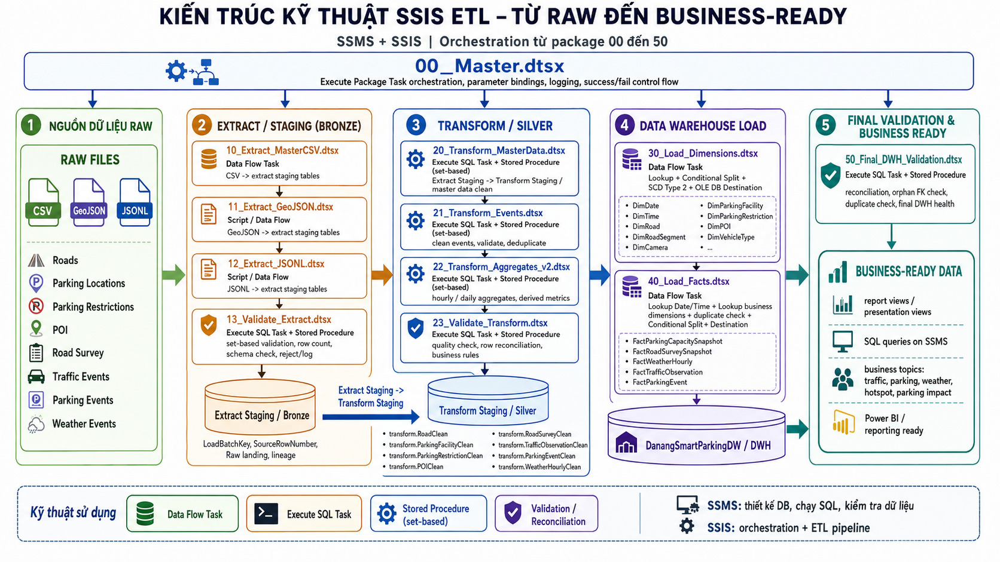

# Da Nang Parking & Traffic Analytics — SQL Server Data Warehouse & SSIS ETL

**Xây dựng Kho dữ liệu Phân tích Giao thông và Đỗ xe Đà Nẵng bằng SQL Server và SSIS**

Dự án xây dựng quy trình ETL và kho dữ liệu dạng Dimension–Fact cho bài toán
phân tích giao thông, đỗ xe, hạ tầng đường, POI và thời tiết tại Đà Nẵng.
Dữ liệu được mô phỏng trong 7 ngày và chỉ phục vụ học tập/portfolio, không phải
số liệu chính thức của Thành phố Đà Nẵng.



## Điểm nổi bật

- Nạp 8 nguồn CSV, GeoJSON và JSONL vào vùng Staging/Bronze.
- Làm sạch, chuẩn hóa, khử trùng và gắn cờ chất lượng ở lớp Silver.
- Điều phối bằng `00_Master.dtsx` và các package SSIS theo từng giai đoạn.
- Nạp Dimension và Fact bằng SSIS Data Flow Task.
- Kiểm tra lineage, row count, khóa ngoại, grain và reconciliation.
- Tạo 14 Dimension, 5 Fact và 2 bảng tổng hợp phục vụ phân tích.

## Công nghệ

- Microsoft SQL Server và SQL Server Management Studio (SSMS)
- SQL Server Integration Services (SSIS)
- T-SQL, stored procedure và OLE DB
- Star schema, ETL audit và data-quality gates

## Cấu trúc repository

```text
.
├── ssis/       # Solution, project và các package SSIS
├── sql/        # Script tạo staging, transform, validation và reconciliation
├── docs/etl/   # Hướng dẫn triển khai từng package
├── danang_smart_parking_raw_7d/ # Bộ dữ liệu portfolio/synthetic 7 ngày
└── reports/    # Evidence đối soát baseline
```

## Luồng ETL

```text
RAW
  → Extract/Staging (Bronze)
  → Transform/Clean (Silver)
  → Load Dimensions
  → Load Facts
  → Final DWH Validation
  → Reconciliation
```

## Bắt đầu

1. Đọc [đặc tả dữ liệu và mô hình](Agent.md).
2. Thực hiện các script và package theo [hướng dẫn ETL](docs/etl/README.md).
3. Mở `ssis/DanangSmartParkingETL.sln` bằng Visual Studio có SSIS Projects.
4. Cấu hình lại hai Connection Manager và project parameter theo môi trường.
5. Chạy `00_Master.dtsx`, sau đó chạy các script validation tương ứng.

Không commit mật khẩu, connection string chứa credential, file `.ispac`, database
backup hoặc cấu hình người dùng. Hai Connection Manager mẫu sử dụng Windows
Integrated Security và cần được đổi server theo máy triển khai.
